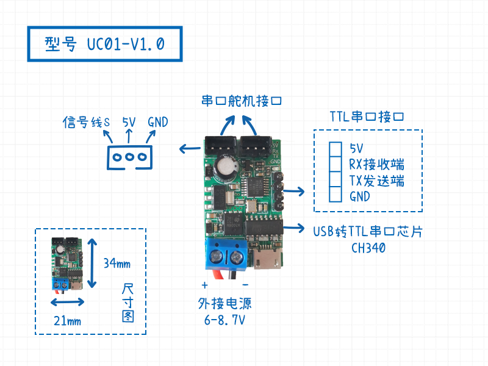
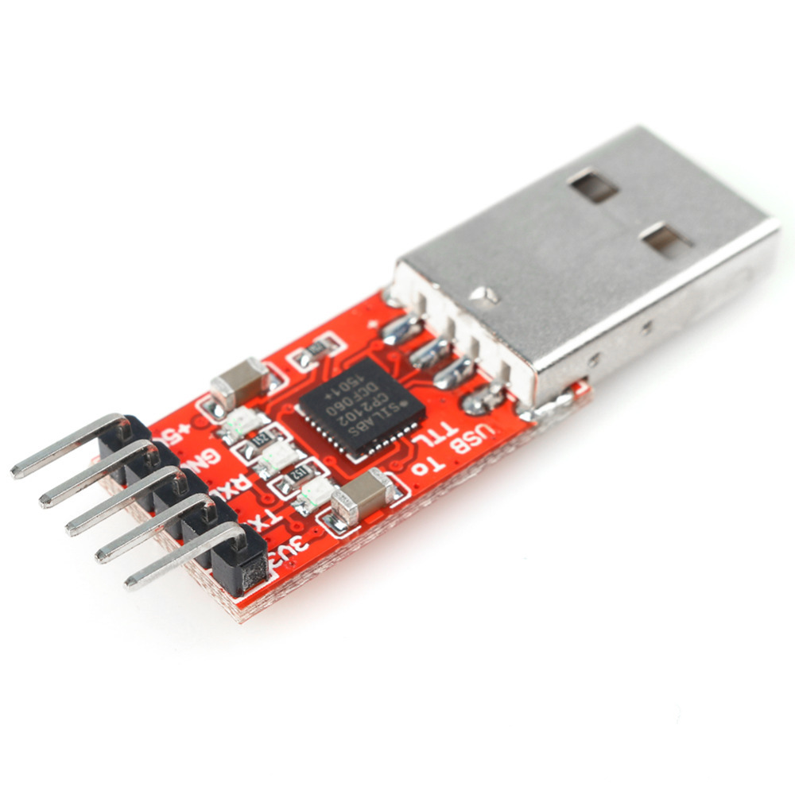

# 物料清单

[toc]

## 概要

列举了舵机云台主题课程（STM32版）所需的物料清单。

## 物料列表

舵机云台主题课程（STM32版）所需的物料清单如下:

| 物料名称                 | 数量 | 备注                            |
| ------------------------ | ---- | ------------------------------- |
| 电脑                     | 1    | 搭载Win10操作系统，用于软件开发 |
| OpenMV                   | 1    | 视觉模块，OpenMV3或OpenMV4      |
| **串口舵机**             | 2    | 型号: RP8-U45                   |
| **串口舵机转接板**       | 1    | 型号: UC01-V1.0                 |
| 舵机云台金属结构件       | 1    |                                 |
| STM32F103小蓝板Blue Pill | 1    | 芯片STM32F103C8T6               |
| ST-Link/v2               | 1    | STM32在线仿真器下载器 调试器    |
| USB转TTL串口             | 1    | CH340 / CP2102                  |
| 按键模块                 | 4    |                                 |
| 小功率激光笔模块         | 1    | 5mW，650nm波长                  |
| 面包板                   | 1    |                                 |
| 杜邦线                   | 若干 |                                 |

## 串口舵机以及相关配件

例程里面使用的串口舵机型号为RP8-U45，但是不局限于这一舵机型号，因为协议都是相同的。

[RP8-U45标准串口总线舵机-购买链接](https://item.taobao.com/item.htm?spm=a1z10.5-c-s.w4002-21603752570.13.65cd2db9H1BUyt&id=600130669485)

串口舵机转接板也在上面的那个购买链接里。

也可以直接采购整套二自由度舵机云台。

[二自由度舵机云台-购买链接](https://item.taobao.com/item.htm?spm=a1z10.5-c-s.w4002-21603752570.15.65cd2db9H1BUyt&id=607274813662)

## STM32F103开发板与配件

STM32F103**小蓝板 Blue Pill** 是单片机STM32F103C8T6的最小系统板，大部分管脚都引出了，方便结合各种传感器与串口舵机做各种应用案例。另外小蓝板的优势就是成本比较低，十几块就可以搞定，有非常好的用户基础。

芯片资料请查阅：*附录A.STM32F103数据手册*

**ST-LINK/V2**是一款可以在线仿真以及下载STM8以及STM32的开发工具。 

**USB转TTL模块**用于连接电脑的USB口和STM32的TTL串口。

STM32输出的日志信息通过串口，经由USB转TTL模块发送到PC的串口上，这样通过PC上的 **串口调试助手** 显示出来。常用的USB转TTL的芯片有CH340和CP2102。如果你购买了两个串口舵机转接板的话，其中一个也可以当做USB转TTL模块来使用。

