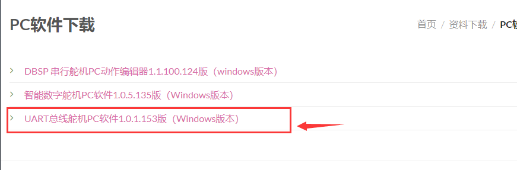

# 开发环境配置

[toc]

## 概要

列举了舵机云台主题课程所需安装的驱动以及软件。

## 串口舵机调试工具

在FashionStar的官网，可以下载UART总线舵机的调试软件。

[FashionStar 舵机配套软件下载地址](https://fashionrobo.com/zh-hans/download/servo-software/)

软件包是一个`rar`后缀的压缩包，直接解压就可以，无需安装。

详情请参阅教程 *串口舵机使用入门 / 1.5舵机调试软件的使用*。　

**参阅教程给串口舵机分配ID**

## Keil5安装

Keil5是STM32的IDE，需要去Keil5的官方网站下载最新的IDE。

 [MDK-Arm官方下载地址](https://www.keil.com/download/product/)

安装好IDE之后，还需要安装STM32 F1系列的芯片包。

请自行搜索相关的视频/文本教程。

## STLinkV2驱动安装

STLink的驱动安装资料以及如何在Keil5中设置下载器选项，可以向销售STLinkV2的店家索要，并获取相关技术支持。

注：如果使用其他下载器也是可以的，并不局限于STLinkV2，只是因为这种下载器比较便宜，占用的管脚也比较少。

## USB转TTL驱动下载与安装

串口舵机转接板使用的USB转TTL串口芯片是`CH340`，需要在Windows上安装CH340的驱动。

[CH340驱动下载地址](http://www.wch.cn/download/CH341SER_EXE.html)

驱动安装完成之后，检查驱动是否安装成功。

[检查CH340驱动是否安装成功](https://jingyan.baidu.com/article/00a07f3872a90982d028dcb9.html)

另外, 你需要安装你所使用的USB转TTL的驱动（例如CP2102）。

 

## 串口调试助手

串口调试助手，推荐使用正点原子开发的XCOM V2.2。

[XCOM V2.2下载地址](https://www.amobbs.com/forum.php?mod=attachment&aid=NDQxNzc5fDE5NzMzYjQ1fDE1NzY2NTQ4NTN8MHw1NzAzODMz)（直接下载，无需注册）

[XCOM V2.2功能介绍](https://www.amobbs.com/thread-5703833-1-1.html)

## OpenMV 驱动与IDE安装

因为使用到了OpenMV视觉模块，所以需要安装OpenMV IDE用于开发测试视觉模块相关的功能。

[OpenMV IDE下载地址](https://openmv.io/pages/download)

安装IDE的同时也会安装OpenMV 所需的驱动。

参考视频教程：

* [OpenMV视频教程03-驱动、IDE的安装与使用](https://www.bilibili.com/video/av21956715?from=search&seid=4514684372801241760)

* [OpenMV IDE安装与OpenMV校准](https://www.bilibili.com/video/av16402952?from=search&seid=4514684372801241760)

* [OpenMV IDE界面介绍](https://www.bilibili.com/video/av16402869?from=search&seid=4514684372801241760)

  其他的学习的资源会在后续的课程里推荐。

