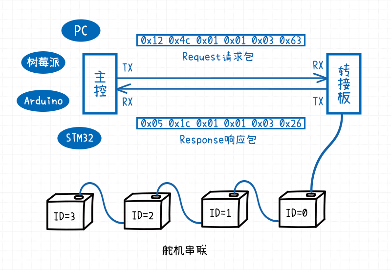
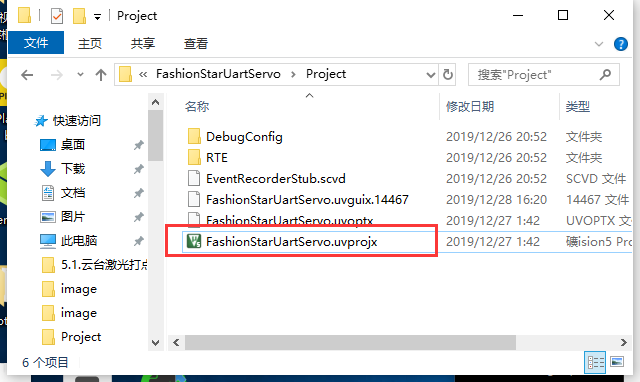
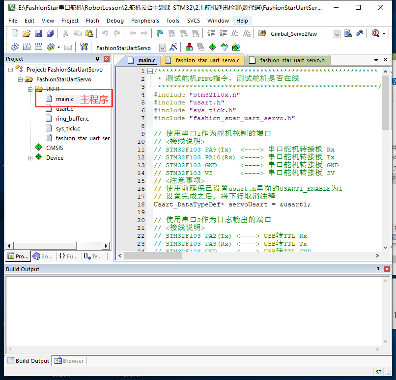
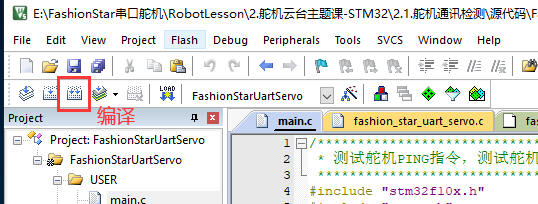
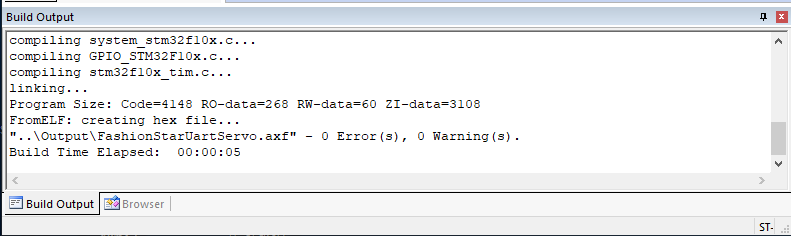
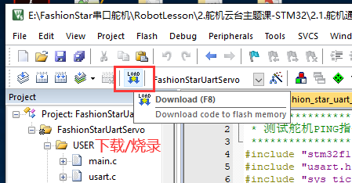
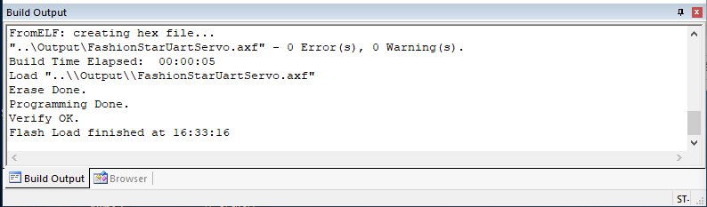
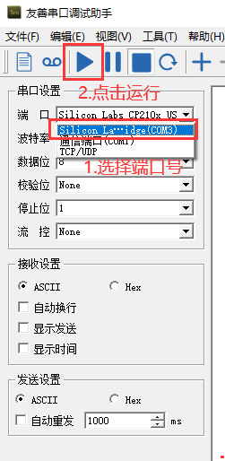
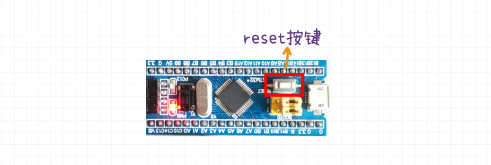
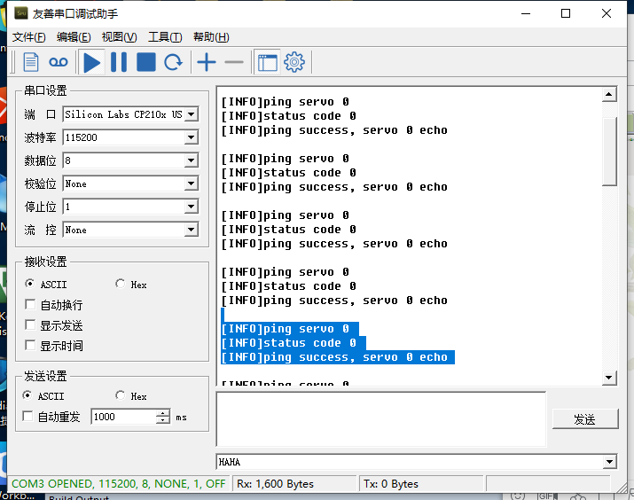

# 舵机通讯检测


[toc]

## 舵机通讯检测指令

检查舵机是否在线，就需要用到PING指令。PING数据包的内容部分是舵机的ID。如果ID号的舵机存在且在线，串口舵机在接收到PING指令时，会发送一个响应包。如果ID号的舵机不存在或者掉线，就不会有舵机发送响应数据包。




## 操作流程

1. **物理接线**

   * STM32与STLinkV2相连接

   * STM32的UART1接串口舵机转接板

     串口舵机转接板上接一个舵机ID为0的串口舵机

   * STM32的UART2接USB转TTL模块

   >  注: 接线部分请参考*1.4接线说明*

   

2. **打开工程文件**

   打开STM32例程的工程文件，文件路径如下

    `2.1舵机通讯检测/源代码/FashionStarUartServo/Project/FashionStarUartServo.uvprojx`

   

   

   

3. **代码编译**

   

   日志输出：编译成功

   

   

4. **将STLinkV2与电脑的USB相连接**

  

5. **将固件下载到STM32**

   

   

   固件载入到STM32 Flash成功的日志输出

   

   

6. **给舵机供电** 

   电池接在UART舵机转接板上。

   

7. **将USB转TTL与电脑USB口相连接**

  

8. **打开串口调试助手软件**

  选择对应的设备号，配置波特率为115200，打开串口。

  > 注: 这里以友善串口调试助手为例

  

  

9. **重置STM32**

   按下STM32开发板上的**RESET** 重置按钮。STM32执行新写入的固件。

   > 注：只有按下重置按键，STM32才会执行新烧录的固件。

   

   

10. **查看串口调试助手上的日志信息**

  

  

## 硬件资源初始化

首先是引入四个依赖的库文件。

```c
#include "stm32f10x.h" 
#include "usart.h"
#include "sys_tick.h"
#include "fashion_star_uart_servo.h"
```

第一个`stm32f10x.h `是STM32F103的标准库，剩下三个是自定义的库。

* `sys_tick.h` 

  管理系统时间，通过配置系统定时器中断，实现了延时以及倒计时的逻辑。

* `usart.h`

  串口通信的库。通过配置宏，可以方便的打开关闭STM32F103C8开发板上三个USART资源。

* `fashion_star_uart_servo.h` 

  封装了Fashion Star 串口舵机的通信协议，是串口舵机STM32F103版本的SDK。


首先定义两个`Usart_DataTypeDef` 结构体指针。

串口1用于舵机控制，指针`servoUsart`指向`usart1`。

```c
 Usart_DataTypeDef* servoUsart = &usart1; 
```

串口2用于日志输出，指针`loggingUsart`指向`usart2`。

```c
Usart_DataTypeDef* loggingUsart = &usart2;
```

接下来依次进行滴答定时器初始化与串口初始化。

```c
// 嘀嗒定时器初始化
SysTick_Init();
// 串口初始化
Usart_Init();
```


## API使用说明

接下来就是舵机通讯检测函数`FSUS_Ping`，依次传入串口数据结构体指针`servoUsart`，还有舵机的ID号`servoId`。

```c
statusCode = FSUS_Ping(servoUsart, servoId);
```

`statusCode`是返回的状态码`FSUS_STATUS`，如果是请求成功则返回`0`，如果是其他的数值则意味着舵机通讯检测失败。可以在`fashion_star_uart_servo.h` 文件里面查阅不同的statusCode对应的错误。

```c
// FSUS状态码
#define FSUS_STATUS uint8_t
#define FSUS_STATUS_SUCCESS 0 // 设置/读取成功
#define FSUS_STATUS_FAIL 1 // 设置/读取失败
#define FSUS_STATUS_TIMEOUT 2 // 等待超时 
#define FSUS_STATUS_WRONG_RESPONSE_HEADER 3 // 响应头不对
#define FSUS_STATUS_UNKOWN_CMD_ID 4 // 未知的控制指令
#define FSUS_STATUS_SIZE_TOO_BIG 5 // 参数的size大于FSUS_PACK_RESPONSE_MAX_SIZE里面的限制
#define FSUS_STATUS_CHECKSUM_ERROR 6 // 校验和错误
#define FSUS_STATUS_ID_NOT_MATCH 7 // 请求的舵机ID跟反馈回来的舵机ID不匹配
```


## 主程序完整源码

```c
/********************************************************
 * 测试舵机PING指令，测试舵机是否在线
 ********************************************************/
#include "stm32f10x.h"
#include "usart.h"
#include "sys_tick.h"
#include "fashion_star_uart_servo.h"

// 使用串口1作为舵机控制的端口
// <接线说明>
// STM32F103 PA9(Tx)  <----> 串口舵机转接板 Rx
// STM32F103 PA10(Rx) <----> 串口舵机转接板 Tx
// STM32F103 GND 	  <----> 串口舵机转接板 GND
// STM32F103 V5 	  <----> 串口舵机转接板 5V
// <注意事项>
// 使用前确保已设置usart.h里面的USART1_ENABLE为1
// 设置完成之后, 将下行取消注释
Usart_DataTypeDef* servoUsart = &usart1; 

// 使用串口2作为日志输出的端口
// <接线说明>
// STM32F103 PA2(Tx) <----> USB转TTL Rx
// STM32F103 PA3(Rx) <----> USB转TTL Tx
// STM32F103 GND 	 <----> USB转TTL GND
// STM32F103 V5 	 <----> USB转TTL 5V (可选)
// <注意事项>
// 使用前确保已设置usart.h里面的USART2_ENABLE为1
Usart_DataTypeDef* loggingUsart = &usart2;

// 重定向c库函数printf到串口，重定向后可使用printf函数
int fputc(int ch, FILE *f)
{
	while((loggingUsart->pUSARTx->SR&0X40)==0){}
	/* 发送一个字节数据到串口 */
	USART_SendData(loggingUsart->pUSARTx, (uint8_t) ch);
	/* 等待发送完毕 */
	// while (USART_GetFlagStatus(USART1, USART_FLAG_TC) != SET);		
	return (ch);
}

// 连接在转接板上的串口舵机ID号
uint8_t servoId = 0; 
// 发送Ping请求的状态码
FSUS_STATUS statusCode; 

int main (void)
{
	// 嘀嗒定时器初始化
	SysTick_Init();
	// 串口初始化
	Usart_Init();
	
	while (1)
    {	
		printf("\r\n");
		// Ping一下舵机
		printf("[INFO]ping servo %d \r\n", servoId);
		statusCode = FSUS_Ping(servoUsart, servoId);
		printf("[INFO]status code %d \r\n", statusCode);
		
		// 根据状态码做不同的处理
		if (statusCode == FSUS_STATUS_SUCCESS){
			printf("[INFO]ping success, servo %d echo \r\n", servoId);
		}else{
			printf("[ERROR]ping fail, servo %d not online \r\n", servoId);
		}
		// 等待1000ms
		SysTick_DelayMs(1000);
    }
}
```
