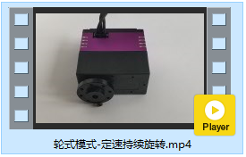
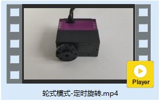
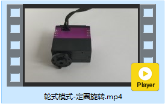

# 舵机轮式模式


[toc]

## API使用说明

### 轮子定速持续旋转

```c
// 轮式模式 不停的旋转
FSUS_STATUS FSUS_WheelKeepMove(Usart_DataTypeDef *usart, uint8_t servoId, uint8_t is_cw, uint16_t speed);
```

* `usart` 舵机控制对应的串口数据对象`Usart_DataTypeDef`
* `servoId` 舵机的ID
* `is_cw` 轮子是否是顺时针旋转
* `0`：否，轮子逆时针旋转
  
* `1`：是，轮子顺时针旋转
* `speed` 舵机旋转的速度  单位 $°/s$

**使用示例**

```c
uint8_t servoId = 0; 	// 连接在转接板上的串口舵机ID号
uint16_t speed = 20; 	// 舵机的旋转方向 20°/s
uint8_t is_cw = 0; 		// 舵机的旋转方向
FSUS_WheelKeepMove(servoUsart, servoId, is_cw, speed);
```


### 轮子停止旋转

```c
// 轮式模式, 舵机停止转动
FSUS_STATUS FSUS_WheelStop(Usart_DataTypeDef *usart, uint8_t servoId);
```

* `usart` 舵机控制对应的串口数据对象`Usart_DataTypeDef`
* `servoId` 舵机的ID

**使用示例**

```c
uint8_t servoId = 0; 	// 连接在转接板上的串口舵机ID号
FSUS_WheelStop(servoUsart, servoId); // 舵机刹车
```


### 轮子旋转特定的时间

```c
// 轮式模式 按照特定的速度旋转特定的时间
FSUS_STATUS FSUS_WheelMoveTime(Usart_DataTypeDef *usart, uint8_t servoId, uint8_t is_cw, uint16_t speed, uint16_t nTime);
```

* `usart` 舵机控制对应的串口数据对象`Usart_DataTypeDef`
* `servoId` 舵机的ID
* `is_cw` 轮子是否是顺时针旋转
  * `0`：否，轮子逆时针旋转
  * `1`：是，轮子顺时针旋转
* `speed` 舵机旋转的速度  单位 $°/s$
* `nTime` 舵机持续旋转的时间，单位ms。

**使用示例**

```c
uint8_t servoId = 0; 	// 连接在转接板上的串口舵机ID号
uint16_t speed = 20; 	// 舵机的旋转方向 20°/s
uint8_t is_cw = 0; 		// 舵机的旋转方向
uint16_t nTime = 3000; 	// 延时时间
FSUS_WheelMoveTime(servoUsart, servoId, is_cw, speed, nTime);
```


### 轮子旋转特定的圈数

```c
// 轮式模式 旋转特定的圈数
FSUS_STATUS FSUS_WheelMoveNCircle(Usart_DataTypeDef *usart, uint8_t servoId, uint8_t is_cw, uint16_t speed, uint16_t nCircle);
```

* `usart` 舵机控制对应的串口数据对象`Usart_DataTypeDef`
* `servoId` 舵机的ID
* `is_cw` 轮子是否是顺时针旋转
  * `0`：否，轮子逆时针旋转
  * `1`：是，轮子顺时针旋转
* `speed` 舵机旋转的速度  单位 $°/s$
* `nCircle` 舵机持续旋转的圈数，单位：圈

**使用示例**

```c
uint8_t servoId = 0; 	// 连接在转接板上的串口舵机ID号
uint16_t speed = 200; 	// 舵机的旋转方向 单位°/s
uint8_t is_cw = 0; 		// 舵机的旋转方向
uint16_t nCircle = 1; 	// 舵机旋转的圈数
FSUS_WheelMoveNCircle(servoUsart, servoId, is_cw, speed, nCircle);
```


## 舵机持续旋转

### 功能简介

测试舵机360度定速持续旋转


### 效果视频

[轮式模式-定速持续旋转](http://v.qq.com/x/page/o30459vwv0n.html)




### 源代码

```c
#include "stm32f10x.h"
#include "usart.h"
#include "sys_tick.h"
#include "fashion_star_uart_servo.h"

// 使用串口1作为舵机控制的端口
// <接线说明>
// STM32F103 PA9(Tx)  <----> 串口舵机转接板 Rx
// STM32F103 PA10(Rx) <----> 串口舵机转接板 Tx
// STM32F103 GND 	  <----> 串口舵机转接板 GND
// STM32F103 V5 	  <----> 串口舵机转接板 5V
// <注意事项>
// 使用前确保已设置usart.h里面的USART1_ENABLE为1
// 设置完成之后, 将下行取消注释
Usart_DataTypeDef* servoUsart = &usart1; 

FSUS_STATUS statusCode; // 请求包的状态码
uint8_t servoId = 0; 	// 连接在转接板上的串口舵机ID号
uint16_t speed = 20; 	// 舵机的旋转方向 20°/s
uint8_t is_cw = 0; 		// 舵机的旋转方向
int main (void)
{
	// 嘀嗒定时器初始化
	SysTick_Init();
	// 串口初始化
	Usart_Init();
	
	while (1){
		// 舵机轮式模式定速控制 顺时针旋转3s
		is_cw = 1;
		FSUS_WheelKeepMove(servoUsart, servoId, is_cw, speed);
		SysTick_DelayMs(3000);
		
		// 舵机刹车 停顿2s 
		FSUS_WheelStop(servoUsart, servoId);
		SysTick_DelayMs(1000);
		
		// 舵机轮式模式定速控制 逆时针旋转3s
		is_cw = 0;
		FSUS_WheelKeepMove(servoUsart, servoId, is_cw, speed);
		SysTick_DelayMs(3000);
		
		// 舵机刹车 停顿2s 
		FSUS_WheelStop(servoUsart, servoId);
		SysTick_DelayMs(1000);
	}
}
```


## 舵机定时旋转

### 功能简介

测试舵机定时旋转，顺时针旋转3s，然后逆时针旋转3s。


### 效果视频

[轮式模式-定时旋转](http://v.qq.com/x/page/o3045zr6rsj.html)




### 源代码

```c
/***************************************************
 * 轮式控制模式 定时旋转
 * <注意事项>
 * 	  在测试本例程时, 请确保舵机没有机械结构/接线的约束, 
 * 	  舵机可以360度旋转
 ***************************************************/
#include "stm32f10x.h"
#include "usart.h"
#include "sys_tick.h"
#include "fashion_star_uart_servo.h"

// 使用串口1作为舵机控制的端口
// <接线说明>
// STM32F103 PA9(Tx)  <----> 串口舵机转接板 Rx
// STM32F103 PA10(Rx) <----> 串口舵机转接板 Tx
// STM32F103 GND 	  <----> 串口舵机转接板 GND
// STM32F103 V5 	  <----> 串口舵机转接板 5V
// <注意事项>
// 使用前确保已设置usart.h里面的USART1_ENABLE为1
// 设置完成之后, 将下行取消注释
Usart_DataTypeDef* servoUsart = &usart1; 

FSUS_STATUS statusCode; // 请求包的状态码
uint8_t servoId = 0; 	// 连接在转接板上的串口舵机ID号
uint16_t speed = 20; 	// 舵机的旋转方向 20°/s
uint8_t is_cw = 0; 		// 舵机的旋转方向
uint16_t nTime = 3000; 	// 延时时间
int main (void)
{
	// 嘀嗒定时器初始化
	SysTick_Init();
	// 串口初始化
	Usart_Init();
	
	while (1){
		// 舵机轮式模式定速控制 顺时针旋转3s
		is_cw = 1;
		FSUS_WheelMoveTime(servoUsart, servoId, is_cw, speed, nTime);
		// FSUS_WheelMoveTime是非阻塞的,因为有时候需要控制多个舵机同时旋转
		// 所以在后面要手动加延迟
		SysTick_DelayMs(nTime);
		
		// 停顿1s 
		SysTick_DelayMs(1000);
		
		// 舵机轮式模式定速控制 逆时针旋转3s
		is_cw = 0;
		FSUS_WheelMoveTime(servoUsart, servoId, is_cw, speed, nTime);
		SysTick_DelayMs(nTime);
		
		// 停顿1s 
		SysTick_DelayMs(1000);
	}
}
```


## 舵机定圈旋转

### 功能简介

测试舵机定圈旋转，顺时针旋转一圈，然后逆时针旋转一圈。


### 效果视频

[轮式模式-定圈旋转](http://v.qq.com/x/page/m3045fsquzw.html)




### 源代码

```c
/***************************************************
 * 轮式控制模式 定圈旋转
 * <注意事项>
 * 	  在测试本例程时, 请确保舵机没有机械结构/接线的约束, 
 * 	  舵机可以360度旋转
 ***************************************************/
#include "stm32f10x.h"
#include "usart.h"
#include "sys_tick.h"
#include "fashion_star_uart_servo.h"

// 使用串口1作为舵机控制的端口
// <接线说明>
// STM32F103 PA9(Tx)  <----> 串口舵机转接板 Rx
// STM32F103 PA10(Rx) <----> 串口舵机转接板 Tx
// STM32F103 GND 	  <----> 串口舵机转接板 GND
// STM32F103 V5 	  <----> 串口舵机转接板 5V
// <注意事项>
// 使用前确保已设置usart.h里面的USART1_ENABLE为1
// 设置完成之后, 将下行取消注释
Usart_DataTypeDef* servoUsart = &usart1; 

FSUS_STATUS statusCode; // 请求包的状态码
uint8_t servoId = 0; 	// 连接在转接板上的串口舵机ID号
uint16_t speed = 200; 	// 舵机的旋转方向 单位°/s
uint8_t is_cw = 0; 		// 舵机的旋转方向
uint16_t nCircle = 1; 	// 舵机旋转的圈数

// 估计旋转圈数所需要花费的时间
uint16_t estimateTimeMs(uint16_t nCircle, uint16_t speed){
	return (uint16_t)((float)nCircle * 360.0 / (float)speed * 1000);
}

int main (void)
{
	// 嘀嗒定时器初始化
	SysTick_Init();
	// 串口初始化
	Usart_Init();
	
	while (1){
		// 舵机轮式模式定速控制 顺时针旋转1圈
		is_cw = 1;
		FSUS_WheelMoveNCircle(servoUsart, servoId, is_cw, speed, nCircle);
		// FSUS_WheelMoveNCircle是非阻塞的,因为有时候需要控制多个舵机同时旋转
		// 延时估算所需时间
		SysTick_DelayMs(estimateTimeMs(nCircle, speed));
		
		// 停顿1s 
		SysTick_DelayMs(1000);
		
		// 舵机轮式模式定速控制 逆时针旋转1圈
		is_cw = 0;
		FSUS_WheelMoveNCircle(servoUsart, servoId, is_cw, speed, nCircle);
		// 注意: FSUS_WheelMoveNCircle是非阻塞的,因为有时候需要控制多个舵机同时旋转
		// 延时估算所需时间
		SysTick_DelayMs(estimateTimeMs(nCircle, speed));
		
		// 停顿1s 
		SysTick_DelayMs(1000);
	}
}
```

