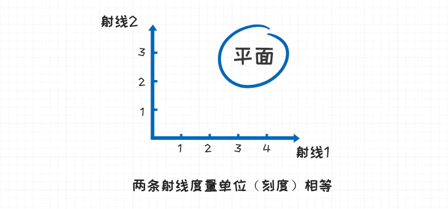
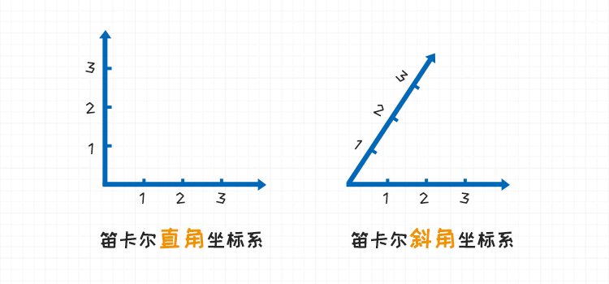
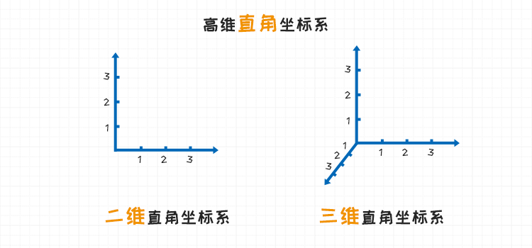
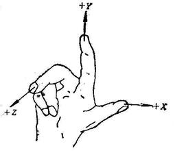
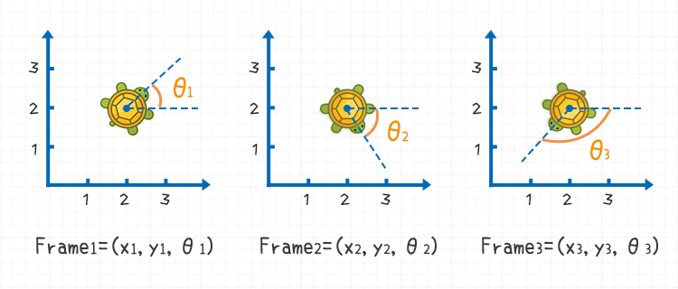
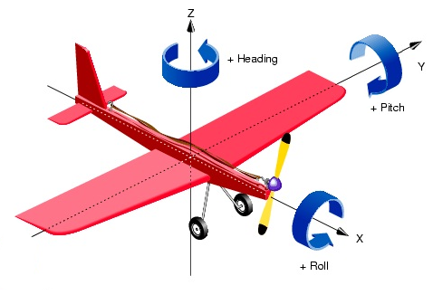

# 机器人的坐标系与位姿

[TOC]

## 概要

本文介绍了笛卡尔坐标系的分类，还有在笛卡尔坐标系中经常会被用到的右手坐标系。

以及机器人在平面直角坐标系与空间直角坐标系下的位姿描述。 

## 笛卡尔坐标系

在空间中有两条或三条**数轴**相交于原点。

两条数轴构成了一个**平面**，三条数轴构成了一个立体的空间。如果数轴上的刻度(度量单位)一致，那么形成的这个坐标系就叫做**笛卡尔坐标系**。

**笛卡尔坐标** 的英文叫做 **Cartesian Coordinate System**。

根据数轴之间是否垂直，笛卡尔坐标系又可以分为**笛卡尔直角坐标系**和**笛卡尔斜角坐标系**。其中笛卡尔直角坐标系我们用的比较多。

根据维度（数轴个数）的不同，笛卡尔直角坐标系又可以分为**二维直角坐标系** 和 **三维直角坐标系**。

另外，不管是二维的还是三维的都存在一个问题，如果我修改坐标轴的正方向，那此时点在坐标系中的位置就会是一个相反的值。根据轴与轴之间正方向关系，笛卡尔直角坐标系，又分为**左手直角坐标系** 和 **右手直角坐标系**。

在空间直角坐标系中，让右手拇指指向x轴的正方向，食指指向y轴的正方向，如果中指能指向z轴的正方向，则称这个坐标系为**右手直角坐标系**，反之则是**左手直角坐标系**。

下图为右手坐标系的示意图：

在数学中则通常使用右手坐标系，我们研究机器人在空间中的关系时，使用的也是**右手坐标系**。

## 位姿描述

**位姿 Pose**是两个属性**位置 Position**和**旋转 Orientation** 的叠加。

说到**位置 Position**，大家比较熟悉，在二维直角坐标系下，$(x, y)$ 两个值可以确定一个点在平面中的位置。在三维的直角坐标系下，$(x, y, z)$ 三个值可以确定一个点在立体空间中的位置。

对于一个机器人来讲，它并不能被看成一个点，它有体积，在同一个点上可以有不同的**朝向**或者是说**倾角**，而**旋转 Orientation** 就是用于刻画机器人在当前坐标系下在各个轴上面的**倾角**。

接下来，我们来分析一下在二维和三维下的位姿。

### 二维直角坐标系

拿小乌龟举例，小乌龟在平面上运动，将小乌龟的头部所指的方向，作为小乌龟的朝向。在地面上建立一个二维直角坐标系。

图中，小乌龟的**位置Position**都相等。
$$
x_1 = x_2 = x_3
$$

$$
y_1 = y_2 = y_3
$$

但是小乌龟的**旋转**各不相同，使用$\theta$ 来表示小乌龟的旋转。

将x转向y轴方向作为角度正方向，$\theta$的角度取值范围为 $[-180^., 180^.]$，在工程领域习惯使用**弧度 Radian** 来表示角度，所以转换为弧度$\theta$ 的取值范围如下：
$$
-\pi<= \theta <= \pi
$$

### 三维直角坐标系

三维坐标系下，位置描述依然简单，但是描述旋转就有些麻烦了。

我们引入一种方法叫做**RPY角 (Roll，Pitch，Yaw)** 描述法，也叫**固定XYZ轴角 (X-Y-Z Fixed Angles)**描述法

以小车模型为例，小车坐标系定义下图所示：

> 图片来源 :[RPY_angles_of_cars](https://commons.wikimedia.org/wiki/File:RPY_angles_of_cars.png)

飞机的RPY角如下图所示，

按照先后顺序**依次**进行：

* **步骤１** 按照参考坐标系的X轴旋转**Roll**角度，Roll中文名字叫做**横滚角**。

  

* **步骤2**：飞机按照参考坐标系的Y轴旋转**Pitch**角度，Pitch的中文叫做**俯仰角**。

  
  
  
  
* **步骤3** 按照参考坐标系的Z轴旋转**Yaw / Heading**角度，中文名字叫做**偏航角/航向角。**

  

| 英文  | 中文   | 参考轴 | 别名   |
| ----- | ------ | ------ | ------ |
| Roll  | 横滚角 | X      | 回转角 |
| Pitch | 俯仰角 | Y      |        |
| Yaw   | 偏航角 | Z      | 航向角 |

所以对应在3D空间下的Frame就应该是
$$
Frame = (x, y, z, pitch, roll, yaw)
$$

