# 设置云台的RPY角


[toc]

## 阻尼模式标定数据采集

### 数据采集流程

运行STM32工程：*源代码/舵机云台-阻尼模式标定数据采集* 

手持舵机云台，转动云台，通过串口助手可以查看当前云台两个舵机的原始角度。

**1. 调整舵机云台偏航角Yaw为$90°$ 查看原始舵机角度**

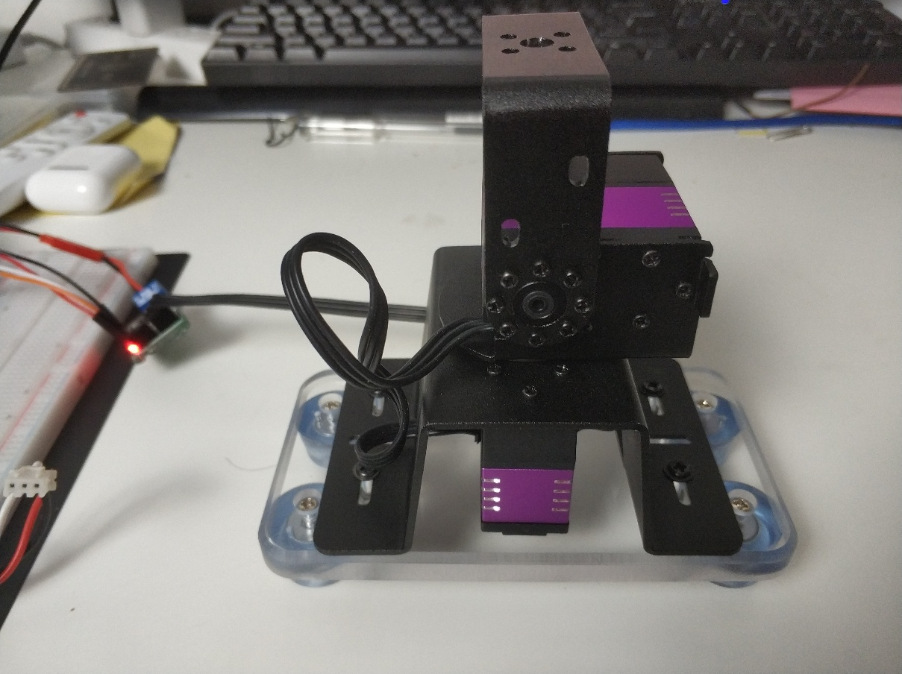

****

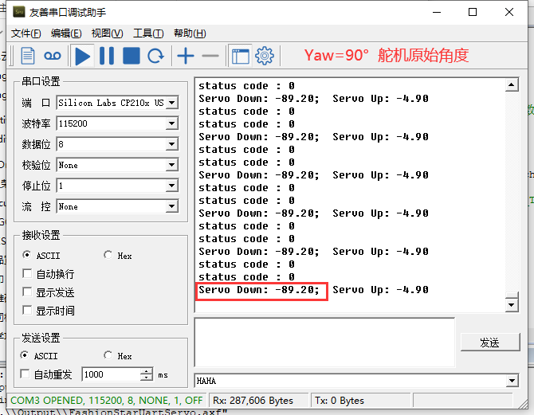


**2. 调整舵机云台偏航角Yaw为$-90°$ 查看原始舵机角度**

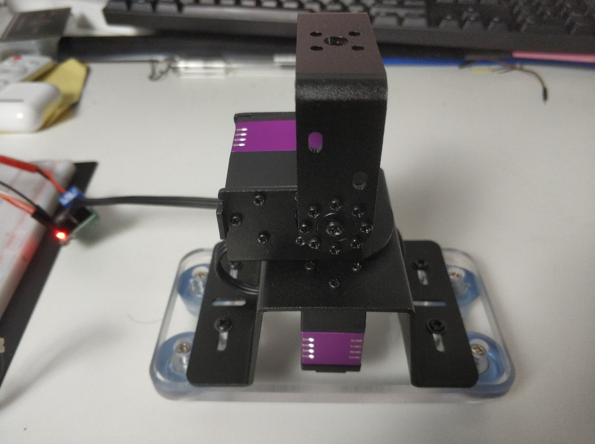

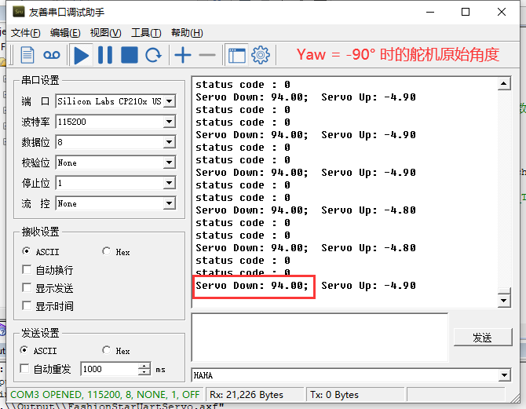


**3. 调整舵机云台俯仰角Pitch为$60°$ 查看原始舵机角度**

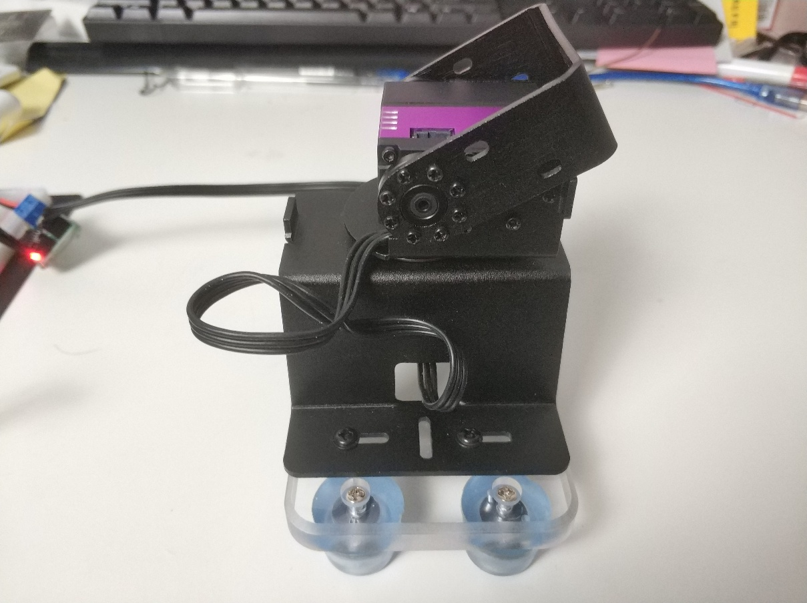

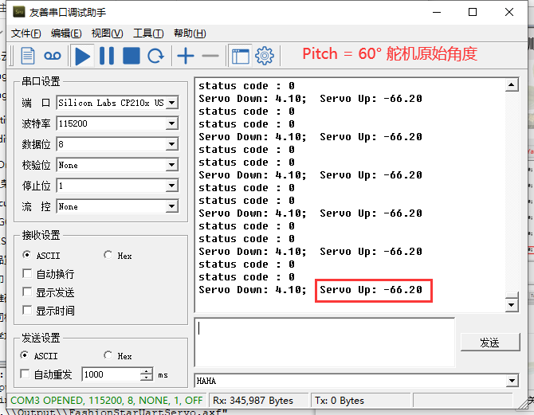


**4. 调整舵机云台俯仰角Pitch为$-90°$ 查看原始舵机角度**

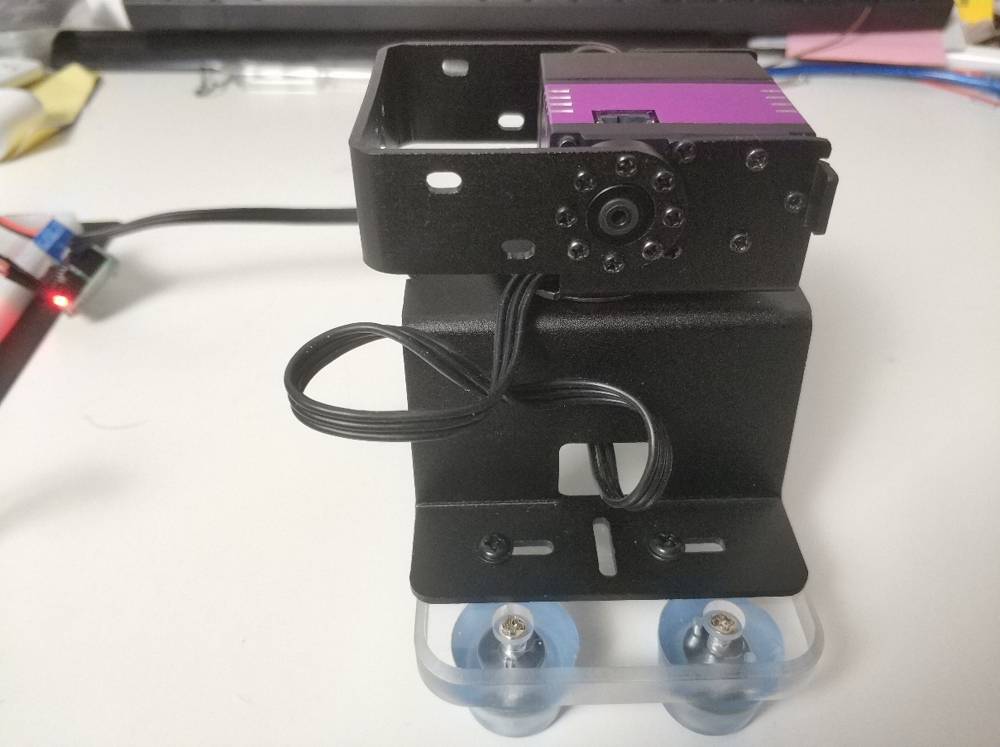

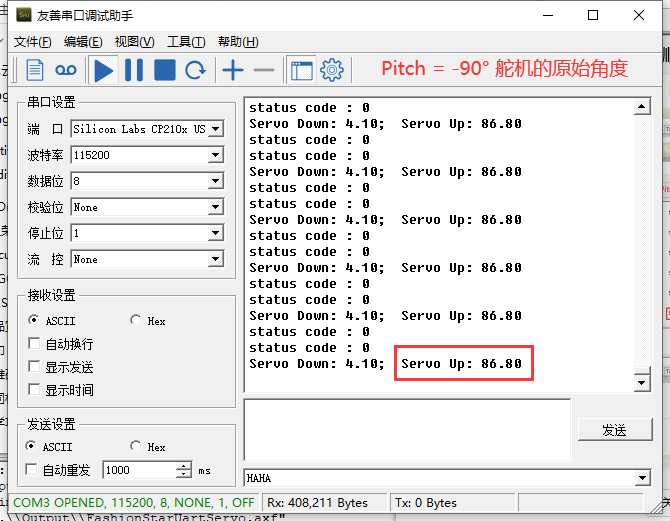


### 源代码

舵机云台阻尼模式下采集标定所需的数据。

设置舵机为阻尼模式后，用手旋转云台的两个舵机，串口2每隔一段时间打印一下舵机角度信息。

```c
#include "stm32f10x.h"
#include "usart.h"
#include "sys_tick.h"
#include "fashion_star_uart_servo.h"

#define SERVO_DOWN 0 // 云台下方的舵机ID
#define SERVO_UP 1 // 云台上方的舵机ID

// 使用串口1作为舵机控制的端口
// <接线说明>
// STM32F103 PA9(Tx)  <----> 串口舵机转接板 Rx
// STM32F103 PA10(Rx) <----> 串口舵机转接板 Tx
// STM32F103 GND 	  <----> 串口舵机转接板 GND
// STM32F103 V5 	  <----> 串口舵机转接板 5V
// <注意事项>
// 使用前确保已设置usart.h里面的USART1_ENABLE为1
// 设置完成之后, 将下行取消注释
Usart_DataTypeDef* servoUsart = &usart1; 
// 使用串口2作为日志输出的端口
// <接线说明>
// STM32F103 PA2(Tx) <----> USB转TTL Rx
// STM32F103 PA3(Rx) <----> USB转TTL Tx
// STM32F103 GND 	 <----> USB转TTL GND
// STM32F103 V5 	 <----> USB转TTL 5V (可选)
// <注意事项>
// 使用前确保已设置usart.h里面的USART2_ENABLE为1
Usart_DataTypeDef* loggingUsart = &usart2;

// 重定向c库函数printf到串口，重定向后可使用printf函数
int fputc(int ch, FILE *f)
{
	while((loggingUsart->pUSARTx->SR&0X40)==0){}
	/* 发送一个字节数据到串口 */
	USART_SendData(loggingUsart->pUSARTx, (uint8_t) ch);
	/* 等待发送完毕 */
	// while (USART_GetFlagStatus(USART1, USART_FLAG_TC) != SET);		
	return (ch);
}

FSUS_STATUS statusCode; // 请求包的状态码

float servoDownAngle = 0; // 下方舵机的角度
float servoUpAngle = 0; 	// 上方舵机的角度

// 云台初始化-设置为阻尼模式
void InitGimbal(void){
	const uint16_t power = 500; // 阻尼模式下的功率，功率越大阻力越大
	Usart_Init(); // 串口初始化
	FSUS_DampingMode(servoUsart, SERVO_DOWN, power); // 设置舵机0为阻尼模式
	FSUS_DampingMode(servoUsart, SERVO_UP, power); // 设置舵机1为阻尼模式
}

// 更新舵机云台舵机的角度
void UpdateGimbalSrvAngle(void){
	uint8_t code;
	code = FSUS_QueryServoAngle(servoUsart, SERVO_DOWN, &servoDownAngle);
	printf("status code : %d \r\n", code);
	code = FSUS_QueryServoAngle(servoUsart, SERVO_UP, &servoUpAngle);
	printf("status code : %d \r\n", code);
}


int main (void)
{
	// 嘀嗒定时器初始化
	SysTick_Init();
	InitGimbal();
	
	while (1){	
		// 更新云台舵机角度
		UpdateGimbalSrvAngle();
		// 打印一下当前舵机的角度信息
		printf("Servo Down: %.2f;  Servo Up: %.2f \r\n", servoDownAngle, servoUpAngle);
		// 等待200ms
		SysTick_DelayMs(200);
    }
}
```


## 设置云台RPY角

打开文件*源代码/舵机云台-设置云台RPY角/FashionStarUartServo/User/gimbal/gimbal.h* 

将在阻尼模式下采集得到的角度同步写入到gimbal.h里面的宏定义中。

| 偏航角Yaw | 宏定义           | 舵机ID | 原始舵机角度 |
| --------- | ---------------- | ------ | ------------ |
| 90.0      | YAW1_SERVO_ANGLE | 0      | -89.2        |
| -90.0     | YAW2_SERVO_ANGLE | 0      | 94           |


| 俯仰角 Pitch | 宏定义             | 舵机ID | 原始舵机角度 |
| ------ | ------------------ | ------ | ------------ |
| 60.0  | PITCH1_SERVO_ANGLE   | 0      | -66.2    |
| -90 | PITCH2_SERVO_ANGLE   | 0      | 86.8       |

`gimbal.h`

```c
// 云台舵机的标定数据
#define YAW1 90.0
#define YAW1_SERVO_ANGLE -89.2
#define YAW2 -90.0
#define YAW2_SERVO_ANGLE 94

#define PITCH1 60.0
#define PITCH1_SERVO_ANGLE -66.2
#define PITCH2 -90.0
#define PITCH2_SERVO_ANGLE 86.8
```


> 注：此例程的标定数据填写完成之后，其他的含有`gimbal.h`的工程，也需要同步替换。

填写完成之后，`gimbal.c`里面的`Gimbal_GenSrvMapParams()`函数会自动计算偏航角/俯仰角与原始舵机角度之间的线性映射关系。

```C
// 偏航角与舵机角度 线性映射
// servo = K_yaw2srv * yaw + b_yaw2srv
float K_yaw2srv; // 偏航角转换为舵机角度的比例系数
float b_yaw2srv; // 偏航角转换为舵机角度的偏移量
// yaw = K_srv2yaw * servo + b_srv2yaw 
float K_srv2yaw; // 舵机角度转换为偏航角的比例系数
float b_srv2yaw; // 舵机角度转换为偏航角的偏移量
// 俯仰角与舵机角度 (线性映射)
// servo = K_pitch2srv * pitch + b_yaw2srv
float K_pitch2srv; // 俯仰角转换为舵机角度的比例系数
float b_pitch2srv; // 俯仰角转换为舵机角度的偏移量
// pitch = K_srv2pitch * servo + b_srv2pitch
float K_srv2pitch; // 舵机角度转换为俯仰角的比例系数
float b_srv2pitch; // 舵机角度转换为俯仰角的偏移量 

```


```C
// 生成舵机角度映射相关的系数
void Gimbal_GenSrvMapParams(void){
	K_yaw2srv = (YAW1_SERVO_ANGLE - YAW2_SERVO_ANGLE) / (YAW1 - YAW2);
	b_yaw2srv = YAW1_SERVO_ANGLE - K_yaw2srv * YAW1;
	K_srv2yaw = (YAW1 - YAW2) / (YAW1_SERVO_ANGLE - YAW2_SERVO_ANGLE);
	b_srv2yaw =  YAW1 - K_srv2yaw *  YAW1_SERVO_ANGLE;
	
	K_pitch2srv = (PITCH1_SERVO_ANGLE - PITCH2_SERVO_ANGLE) / (PITCH1 - PITCH2);
	b_pitch2srv = PITCH1_SERVO_ANGLE - K_pitch2srv * PITCH1;
	K_srv2pitch = (PITCH1 - PITCH2) / (PITCH1_SERVO_ANGLE - PITCH2_SERVO_ANGLE);
	b_srv2pitch = PITCH1 - K_srv2pitch * PITCH1_SERVO_ANGLE;	
}
```


### 效果视频

[舵机云台-设置云台RPY角](http://v.qq.com/x/page/q3045nntc4n.html)

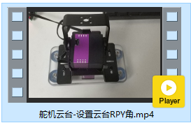


### 源代码

```c
/***************************************************
* 舵机云台控制-设置舵机云台关节角度
 *   设置舵机为阻尼模式后, 用手旋转云台的两个舵机,
 *   串口2每隔一段时间打印一下舵机角度信息
 ***************************************************/
#include "stm32f10x.h"
#include "usart.h"
#include "sys_tick.h"
#include "fashion_star_uart_servo.h"
#include "gimbal.h"


// 使用串口1作为舵机控制的端口
// <接线说明>
// STM32F103 PA9(Tx)  <----> 串口舵机转接板 Rx
// STM32F103 PA10(Rx) <----> 串口舵机转接板 Tx
// STM32F103 GND 	  <----> 串口舵机转接板 GND
// STM32F103 V5 	  <----> 串口舵机转接板 5V
// <注意事项>
// 使用前确保已设置usart.h里面的USART1_ENABLE为1
// 设置完成之后, 将下行取消注释
Usart_DataTypeDef* servoUsart = &usart1; 

float servoSpeed = 200.0; // 云台旋转速度 (单位: °/s)
int main (void)
{
	// 嘀嗒定时器初始化
	SysTick_Init();
	Usart_Init(); // 串口初始化
	// 云台初始化
	Gimbal_Init(servoUsart);
	// 等待2s
	SysTick_DelayMs(2000);	
	
	while (1){
		// 设置云台目标位姿
		Gimbal_SetYaw(servoUsart, 60, servoSpeed);
		Gimbal_SetPitch(servoUsart, 45, servoSpeed);
		// 等待云台旋转到目标位置
		Gimbal_Wait(servoUsart);
		
		// 延时1s
		SysTick_DelayMs(1000);
		
		// 设置云台目标位姿
		Gimbal_SetYaw(servoUsart, -60, servoSpeed);
		Gimbal_SetPitch(servoUsart, -45, servoSpeed);
		// 等待云台旋转到目标位置
		Gimbal_Wait(servoUsart);
		
		// 延时1s
		SysTick_DelayMs(1000);
    }
}
```


## 按键中断控制云台

通过配置按键中断控制舵机云台的偏航角与俯仰角。

### 效果视频

[舵机云台-按键中断控制云台](http://v.qq.com/x/page/d3045ovfkvb.html)

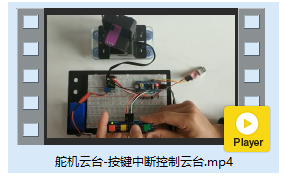


### 接线说明

需要用到四个按键分别调节偏航角与俯仰角的增加和减少。

为了接线方便，这里使用的是四位独立按键模块，你也可以使用四个按键模块，或者在面包板上搭建电路。

| STM32F103 | 按键模块 | 备注              |
| --------- | -------- | ----------------- |
| PB_4      | KEY1     | 偏航角增加 + 按键 |
| PB_5      | KEY2     | 偏航角减少 - 按键 |
| PB_6      | KEY3     | 俯仰角增加 + 按键 |
| PB_7      | KEY4     | 俯仰角减少 - 按键 |
| 5V        | VCC      |                   |
| GND       | GND      |                   |


**接线图**

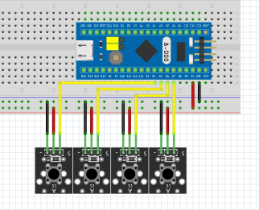


### 源代码
`main.c` 主程序

```c
/***************************************************
 * 舵机云台控制-按键中断控制云台
 ***************************************************/
#include "stm32f10x.h"
#include "usart.h"
#include "sys_tick.h"
#include "fashion_star_uart_servo.h"
#include "gimbal.h"
#include "button.h"

// 使用串口1作为舵机控制的端口
// <接线说明>
// STM32F103 PA9(Tx)  <----> 串口舵机转接板 Rx
// STM32F103 PA10(Rx) <----> 串口舵机转接板 Tx
// STM32F103 GND 	  <----> 串口舵机转接板 GND
// STM32F103 V5 	  <----> 串口舵机转接板 5V
// <注意事项>
// 使用前确保已设置usart.h里面的USART1_ENABLE为1
// 设置完成之后, 将下行取消注释
Usart_DataTypeDef* servoUsart = &usart1; 
// 使用串口2作为日志输出的端口
// <接线说明>
// STM32F103 PA2(Tx) <----> USB转TTL Rx
// STM32F103 PA3(Rx) <----> USB转TTL Tx
// STM32F103 GND 	 <----> USB转TTL GND
// STM32F103 V5 	 <----> USB转TTL 5V (可选)
// <注意事项>
// 使用前确保已设置usart.h里面的USART2_ENABLE为1
Usart_DataTypeDef* loggingUsart = &usart2;

// 重定向c库函数printf到串口，重定向后可使用printf函数
int fputc(int ch, FILE *f)
{
	while((loggingUsart->pUSARTx->SR&0X40)==0){}
	/* 发送一个字节数据到串口 */
	USART_SendData(loggingUsart->pUSARTx, (uint8_t) ch);
	/* 等待发送完毕 */
	// while (USART_GetFlagStatus(USART1, USART_FLAG_TC) != SET);		
	return (ch);
}

float servoSpeed = 100.0; // 云台旋转速度 (单位: °/s)

int main (void)
{
	SysTick_Init(); 		// 嘀嗒定时器初始化
	Usart_Init(); 			// 串口初始化
	Gimbal_Init(servoUsart);// 云台初始化
	Button_Init(); 			// 按键初始化
	SysTick_DelayMs(2000); 	// 等待2s	
	
	while (1){
		if (__fabs(curYaw - nextYaw) > SERVO_DEAD_BLOCK){
			printf("nextYaw: %.1f  nextPitch: %.1f\r\n", nextYaw, nextPitch);
			Gimbal_SetYaw(servoUsart, nextYaw, servoSpeed);
		}
		if (__fabs(curPitch - nextPitch) > SERVO_DEAD_BLOCK){
			printf("nextYaw: %.1f  nextPitch: %.1f\r\n", nextYaw, nextPitch);
			Gimbal_SetPitch(servoUsart, nextPitch, servoSpeed);
		}
		
		// 延时5ms 需要必要的延时，防止指令被覆盖
		SysTick_DelayMs(5);
    }
}

```

在工程文件*User/button/button.c*里面定义了按键中断相关的逻辑。

`button.c`

```c
#include "button.h"


void EXTI4_IRQHandler(void){
	if(EXTI_GetITStatus(EXTI_Line4) != RESET){
		// 偏航角增加
		nextYaw = nextYaw + BUTTON_ANGLE_STEP;
		nextYaw = nextYaw > YAW_MAX ? YAW_MAX : nextYaw;
		// 清除中断标志
		EXTI_ClearITPendingBit(EXTI_Line4);
	}
	
}

void EXTI9_5_IRQHandler(void){
	if(EXTI_GetITStatus(EXTI_Line5) != RESET){
		nextYaw = nextYaw - BUTTON_ANGLE_STEP; // 偏航角减少
		nextYaw = nextYaw < YAW_MIN ? YAW_MIN : nextYaw;		
		// 清除中断标志
		EXTI_ClearITPendingBit(EXTI_Line5);
	}
	
	if(EXTI_GetITStatus(EXTI_Line6) != RESET){
		nextPitch = nextPitch + BUTTON_ANGLE_STEP; // 俯仰角增加
		nextPitch = nextPitch > PITCH_MAX ? PITCH_MAX: nextPitch;
		EXTI_ClearITPendingBit(EXTI_Line6); // 清除中断标志
	}
	if(EXTI_GetITStatus(EXTI_Line7) != RESET){
		nextPitch = nextPitch - BUTTON_ANGLE_STEP; // 俯仰角减少
		nextPitch  = nextPitch < PITCH_MIN ? PITCH_MIN: nextPitch;
		EXTI_ClearITPendingBit(EXTI_Line7); // 清除中断标志
	}
	
}

// 配置嵌套向量中断控制器
void Button_NVIC(void){
	NVIC_InitTypeDef NVIC_InitStructure;
	
	NVIC_InitStructure.NVIC_IRQChannel = EXTI9_5_IRQn;
	NVIC_InitStructure.NVIC_IRQChannelPreemptionPriority = 3;
	NVIC_InitStructure.NVIC_IRQChannelSubPriority = 3;
	NVIC_InitStructure.NVIC_IRQChannelCmd = ENABLE;
	NVIC_Init(&NVIC_InitStructure);
	
	NVIC_InitStructure.NVIC_IRQChannel = EXTI4_IRQn;
	NVIC_InitStructure.NVIC_IRQChannelPreemptionPriority = 3;
	NVIC_InitStructure.NVIC_IRQChannelSubPriority = 3;
	NVIC_InitStructure.NVIC_IRQChannelCmd = ENABLE;
	NVIC_Init(&NVIC_InitStructure);
}

// 按键GPIO配置
void Button_GPIO(void){
	GPIO_InitTypeDef GPIO_InitStructure; // IO配置结构体
	GPIO_InitStructure.GPIO_Mode = GPIO_Mode_IPD; // 上拉输入
	
	// PB4: 按键-偏航角增加
	GPIO_InitStructure.GPIO_Pin = BUTTON_YAW_ADD_PIN;
	GPIO_Init(BUTTON_YAW_ADD_PORT, &GPIO_InitStructure);
	// PB5: 按键-偏航角减少
	GPIO_InitStructure.GPIO_Pin = BUTTON_YAW_MINUS_PIN;
	GPIO_Init(BUTTON_YAW_MINUS_PORT, &GPIO_InitStructure);
	// PB6: 按键-俯仰角增加
	GPIO_InitStructure.GPIO_Pin = BUTTON_PITCH_ADD_PIN;
	GPIO_Init(BUTTON_PITCH_ADD_PORT, &GPIO_InitStructure);
	// PB7: 按键-俯仰角减少
	GPIO_InitStructure.GPIO_Pin = BUTTON_PITCH_MINUS_PIN;
	GPIO_Init(BUTTON_PITCH_MINUS_PORT, &GPIO_InitStructure);
	
}

// 按键外部中断配置
void Button_EXTI(void){
	GPIO_EXTILineConfig(GPIO_PortSourceGPIOB, GPIO_PinSource0);
	EXTI_InitTypeDef EXTI_InitStructure;
	EXTI_InitStructure.EXTI_Mode = EXTI_Mode_Interrupt;
	EXTI_InitStructure.EXTI_Trigger = EXTI_Trigger_Falling; // 下降沿触发中断
	EXTI_InitStructure.EXTI_LineCmd = ENABLE;
	EXTI_Init(&EXTI_InitStructure);
	
	GPIO_EXTILineConfig(GPIO_PortSourceGPIOB, GPIO_PinSource4);
	EXTI_InitStructure.EXTI_Line = EXTI_Line4;
	EXTI_Init(&EXTI_InitStructure);
	
	GPIO_EXTILineConfig(GPIO_PortSourceGPIOB, GPIO_PinSource5);
	EXTI_InitStructure.EXTI_Line = EXTI_Line5;
	EXTI_Init(&EXTI_InitStructure);
	
	GPIO_EXTILineConfig(GPIO_PortSourceGPIOB, GPIO_PinSource6);
	EXTI_InitStructure.EXTI_Line = EXTI_Line6;
	EXTI_Init(&EXTI_InitStructure);
	
	GPIO_EXTILineConfig(GPIO_PortSourceGPIOB, GPIO_PinSource7);
	EXTI_InitStructure.EXTI_Line = EXTI_Line7;
	EXTI_Init(&EXTI_InitStructure);
}

// 按键初始化
void Button_Init(void){
	// 开启时钟
	RCC_APB2PeriphClockCmd(RCC_APB2Periph_GPIOB | RCC_APB2Periph_AFIO, ENABLE);
	// 配置嵌套向量中断控制器
	Button_NVIC();
	// 按键GPIO配置
	Button_GPIO();
	// 按键外部中断配置
	Button_EXTI();
}
```

