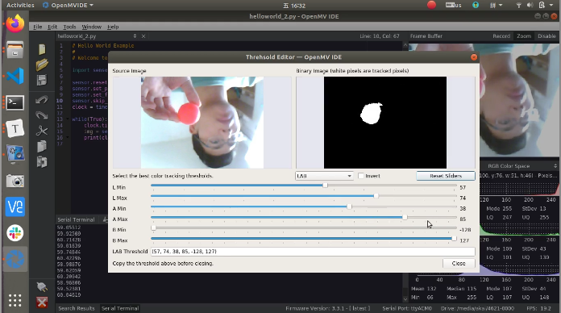
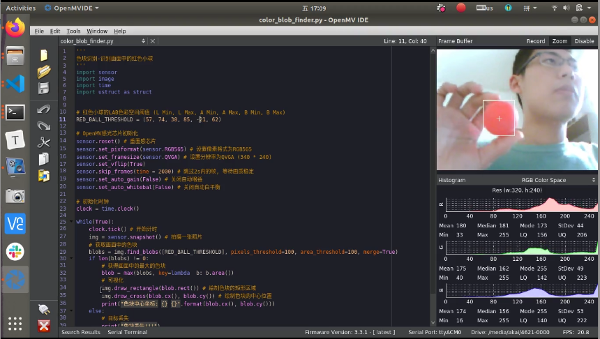

# OpenMV色块识别


[toc]

## 阈值调节

运行HelloWorld例程，手持红色小球。打开阈值调节工具，调节红色小球的LAB色彩空间的阈值。

**操作视频**

[OpenMV颜色阈值可视化调参](http://v.qq.com/x/page/q3045qz4nbm.html)




## 修改代码中的颜色阈值

通过OpenMV IDE打开OpenMV色块识别的示例代码。

文件路径: `4.2.OpenMV色块识别/源代码/OpenMV/color_blob_finder.py`


将调节得到的LAB颜色阈值，赋值给`RED_BALL_THRESHOLD`。

```python
# 红色小球的LAB色彩空间阈值 (L Min, L Max, A Min, A Max, B Min, B Max)
RED_BALL_THRESHOLD = (57, 74, 38, 85, -21, 62)
```


**色块识别的完整源码**

```python
'''
色块识别-识别画面中的红色小球
'''
import sensor
import image
import time

# 红色小球的LAB色彩空间阈值 (L Min, L Max, A Min, A Max, B Min, B Max)
RED_BALL_THRESHOLD = (57, 74, 38, 85, -21, 62)

# OpenMV感光芯片初始化
sensor.reset() # 重置感芯片
sensor.set_pixformat(sensor.RGB565) # 设置像素格式为RGB565
sensor.set_framesize(sensor.QVGA) # 设置分辨率为QVGA (340 * 240)
sensor.set_vflip(True)
sensor.skip_frames(time = 2000) # 跳过2s内的帧, 等待画质稳定
sensor.set_auto_gain(False) # 关闭自动增益
sensor.set_auto_whitebal(False) # 关闭自动白平衡

# 初始化时钟
clock = time.clock()

while(True):
    clock.tick() # 开始计时
    img = sensor.snapshot() # 拍摄一张照片
    # 获取画面中的色块
    blobs = img.find_blobs([RED_BALL_THRESHOLD], pixels_threshold=100, area_threshold=100, merge=True)
    if len(blobs) != 0:
        # 获得画面中的最大的色块
        blob = max(blobs, key=lambda  b: b.area())
        # 可视化
        img.draw_rectangle(blob.rect()) # 绘制色块的矩形区域
        img.draw_cross(blob.cx(), blob.cy()) # 绘制色块的中心位置
        print("色块中心坐标: {} {}".format(blob.cx(), blob.cy()))
    else:
        # 目标丢失
        print("色块丢失!!!")
    # 打印当前的帧率
    print(clock.fps())

```


## 运行色块识别的例程

运行代码，查看色块识别的效果。




**效果视频**

[OpenMV色块识别效果演示](http://v.qq.com/x/page/p3045o23zvf.html)