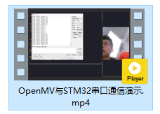
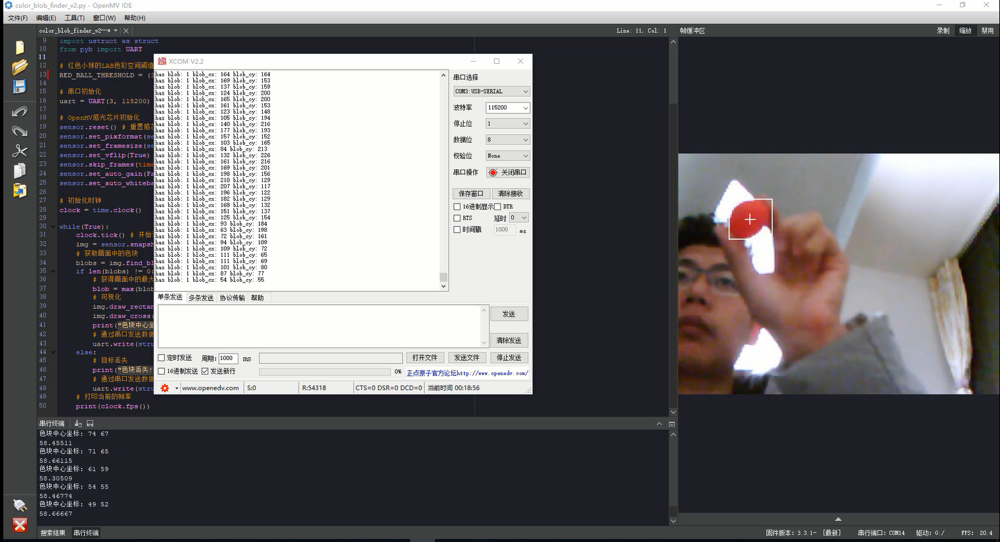
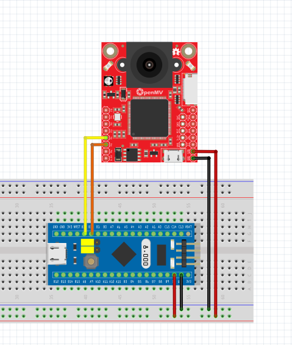
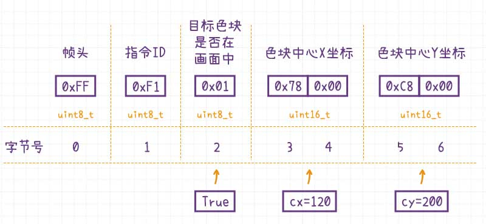

# STM32与OpenMV串口通信


[toc]

## 功能简介

OpenMV识别到色块之后，通过串口通信将色块的中心坐标发送给STM32，STM32解析串口的字节流数据，并将解析得到的色块坐标通过USB转TTL输出到串口调试助手上。


## 效果视频


[OpenMV与STM32串口通信演示](http://v.qq.com/x/page/y3045lwtfe5.html)





## 接线说明

| STM32F103        | OpenMV3             |
| ---------------- | ------------------- |
| PB_11 (UART3 Rx) | P4 (PB10, UART3 Tx) |
| PB_10 (UART3 Tx) | P5 (PB11, UART3 Rx) |
| GND              | GND                 |
| 5V               | VIN                 |

> 注意：STM32F103的5V不能接到OpenMV的3.3v上，会烧坏OpenMV。





## 通信协议

OpenMV视觉模块识别到了色块，需要通过特定的通信协议发送给STM32，通信协议如下：

| 字节序号 | 数据类型 | 字段名称 | 字段功能描述       | 字节长度 |
| -------- | -------- | -------- | ------------------ | -------- |
| 0        | uint8_t  | HEAD     | 帧头               | 1        |
| 1        | uint8_t  | CMD_ID   | 指令ID             | 1        |
| 2        | uint8_t  | HAS_BLOB | 画面中是否存在色块 | 1        |
| 3-4      | uint16_t | BLOB_CX  | 色块中心的x坐标    | 2        |
| 5-6      | uint16_t | BLOB_CY  | 色块中心的y坐标    | 2        |

**示例**




## OpenMV字节数据发送

OpenMV发送字节流，需要通过`ustruct`模块进行打包。代码比较简单，一行代码就可以搞定。

```python
# 通过串口发送数据(二进制　低字节序)
uart.write(struct.pack('<BBBHH', 0xFF, 0xF1, True, blob.cx(), blob.cy()))
```


## STM32字节数据解析

核心代码`updateBlobInfo`函数

```c
// 更新色块的信息
void updateBlobInfo(Usart_DataTypeDef* blobUsart){
	uint8_t tempByte;
	while(RingBuffer_GetByteUsed(blobUsart->recvBuf)){
		// 弹出队首元素
		tempByte = RingBuffer_Pop(blobUsart->recvBuf);
		
		if (blobPkgIdx == 0 && tempByte != BLOB_PKG_HEADER){
			// 帧头还未接收且帧头不匹配
			continue;
		}else if(blobPkgIdx == 1 && tempByte != BLOB_PKG_CMD_ID){
			// 数据指令不匹配
			blobPkgIdx = 0;
			continue;
		}
		
		// 缓冲区内追加数据
		blobPkgBuf[blobPkgIdx] = tempByte;
		blobPkgIdx += 1;
		
		if (blobPkgIdx >= BLOB_PKG_LEN){
			// 数据接收完成, 解析更新数据
			hasBlob = blobPkgBuf[2];
			blobCx =(uint16_t)(blobPkgBuf[3] | blobPkgBuf[4] << 8);
			blobCy = (uint16_t)(blobPkgBuf[5] | blobPkgBuf[6] << 8);
			
			blobPkgIdx = 0; // 游标清零
		}
	}
}
```


## 源代码

### OpenMV主程序完整源码

```python
'''
色块识别
1. 识别画面中的红色小球
2. 将识别的到的色块位置,通过串口发送
'''
import sensor
import image
import time
import ustruct as struct
from pyb import UART

# 红色小球的LAB色彩空间阈值 (L Min, L Max, A Min, A Max, B Min, B Max)
RED_BALL_THRESHOLD = (57, 74, 38, 85, -21, 62)

# 串口初始化
uart = UART(3, 115200)

# OpenMV感光芯片初始化
sensor.reset() # 重置感芯片
sensor.set_pixformat(sensor.RGB565) # 设置像素格式为RGB565
sensor.set_framesize(sensor.QVGA) # 设置分辨率为QVGA (340 * 240)
sensor.set_vflip(True)
sensor.skip_frames(time = 2000) # 跳过2s内的帧, 等待画质稳定
sensor.set_auto_gain(False) # 关闭自动增益
sensor.set_auto_whitebal(False) # 关闭自动白平衡

# 初始化时钟
clock = time.clock()

while(True):
    clock.tick() # 开始计时
    img = sensor.snapshot() # 拍摄一张照片
    # 获取画面中的色块
    blobs = img.find_blobs([RED_BALL_THRESHOLD], pixels_threshold=100, area_threshold=100, merge=True)
    if len(blobs) != 0:
        # 获得画面中的最大的色块
        blob = max(blobs, key=lambda  b: b.area())
        # 可视化
        img.draw_rectangle(blob.rect()) # 绘制色块的矩形区域
        img.draw_cross(blob.cx(), blob.cy()) # 绘制色块的中心位置
        print("色块中心坐标: {} {}".format(blob.cx(), blob.cy()))
        # 通过串口发送数据(二进制　低字节序)
        uart.write(struct.pack('<BBBHH', 0xFF, 0xF1, True, blob.cx(), blob.cy()))
    else:
        # 目标丢失
        print("色块丢失!!!")
        # 通过串口发送数据(二进制　低字节序)
        uart.write(struct.pack('<BBBHH', 0xFF, 0xF1, False, 0, 0))
    # 打印当前的帧率
    print(clock.fps())
```


### STM32主程序完整源码

```c
/***************************************************
 * STM32与OpenMV串口通信
 *   OpenMV识别到色块之后, 通过串口通信将色块的中心
 *   坐标发送给STM32, STM32解析串口的字节流数据, 
 *   并将解析得到的色块坐标通过USB转TTL输出到串口调试助手上.
 ***************************************************/
#include "stm32f10x.h"
#include "usart.h"
#include "sys_tick.h"
#include "fashion_star_uart_servo.h"
#include "gimbal.h"
#include "button.h"

#define TRUE 1
#define FALSE 0

#define IMG_WIDTH 320 // blob画面分辨率 宽度
#define IMG_HEIGHT 240 // blob画面分辨率 高度
#define BLOB_PKG_LEN 7 // blob数据包的长度
#define BLOB_PKG_HEADER 0xFF // 帧头
#define BLOB_PKG_CMD_ID 0xF1 // 指令ID

// 使用串口1作为舵机控制的端口
// <接线说明>
// STM32F103 PA9(Tx)  <----> 串口舵机转接板 Rx
// STM32F103 PA10(Rx) <----> 串口舵机转接板 Tx
// STM32F103 GND 	  <----> 串口舵机转接板 GND
// STM32F103 V5 	  <----> 串口舵机转接板 5V
// <注意事项>
// 使用前确保已设置usart.h里面的USART1_ENABLE为1
// 设置完成之后, 将下行取消注释
Usart_DataTypeDef* servoUsart = &usart1; 
// 使用串口2作为日志输出的端口
// <接线说明>
// STM32F103 PA2(Tx) <----> USB转TTL Rx
// STM32F103 PA3(Rx) <----> USB转TTL Tx
// STM32F103 GND 	 <----> USB转TTL GND
// STM32F103 V5 	 <----> USB转TTL 5V (可选)
// <注意事项>
// 使用前确保已设置usart.h里面的USART2_ENABLE为1
Usart_DataTypeDef* loggingUsart = &usart2;
// 使用串口3接收来自blob的消息
// <接线说明>
// STM32F103 PB10(Tx) <----> blob P5 (UART3 Rx)
// STM32F103 PB11(Rx) <----> blob P4 (UART3 Tx)
// STM32F103 GND 	  <----> blob GND
// STM32F103 V5 	  <----> blob Vin (5v)
// <注意事项>
// 使用前确保已设置usart.h里面的USART3_ENABLE为1
Usart_DataTypeDef* blobUsart = &usart3;


uint8_t blobPkgBuf[BLOB_PKG_LEN]; // blob数据帧缓冲区
uint8_t blobPkgIdx = 0;

// 重定向c库函数printf到串口，重定向后可使用printf函数
int fputc(int ch, FILE *f)
{
	while((loggingUsart->pUSARTx->SR&0X40)==0){}
	/* 发送一个字节数据到串口 */
	USART_SendData(loggingUsart->pUSARTx, (uint8_t) ch);
	/* 等待发送完毕 */
	// while (USART_GetFlagStatus(USART1, USART_FLAG_TC) != SET);		
	return (ch);
}

float servoSpeed = 100.0; // 云台旋转速度 (单位: °/s)

uint8_t hasBlob = FALSE; // 画面中有无色块
uint16_t blobCx = 0; // 色块中心的x坐标
uint16_t blobCy = 0; // 色块中心的y坐标

// 更新色块的信息
void updateBlobInfo(Usart_DataTypeDef* blobUsart){
	uint8_t tempByte;
	while(RingBuffer_GetByteUsed(blobUsart->recvBuf)){
		// 弹出队首元素
		tempByte = RingBuffer_Pop(blobUsart->recvBuf);
		
		if (blobPkgIdx == 0 && tempByte != BLOB_PKG_HEADER){
			// 帧头还未接收且帧头不匹配
			continue;
		}else if(blobPkgIdx == 1 && tempByte != BLOB_PKG_CMD_ID){
			// 数据指令不匹配
			blobPkgIdx = 0;
			continue;
		}
		
		// 缓冲区内追加数据
		blobPkgBuf[blobPkgIdx] = tempByte;
		blobPkgIdx += 1;
		
		if (blobPkgIdx >= BLOB_PKG_LEN){
			// 数据接收完成, 解析更新数据
			hasBlob = blobPkgBuf[2];
			blobCx =(uint16_t)(blobPkgBuf[3] | blobPkgBuf[4] << 8);
			blobCy = (uint16_t)(blobPkgBuf[5] | blobPkgBuf[6] << 8);
			
			blobPkgIdx = 0; // 游标清零
		}
	}
}
	
int main (void)
{
	SysTick_Init(); 		// 嘀嗒定时器初始化
	Usart_Init(); 			// 串口初始化
	Gimbal_Init(servoUsart);// 云台初始化
	
	while(1){
		// 更新Buffer
		if (RingBuffer_GetByteUsed(blobUsart->recvBuf) >= BLOB_PKG_LEN) {
			updateBlobInfo(blobUsart);
		}
		// 打印日志
		printf("has blob: %d blob_cx: %d blob_cy: %d\r\n", hasBlob, blobCx, blobCy);;
		// 延迟100ms
		SysTick_DelayMs(100);
	}
}
```

