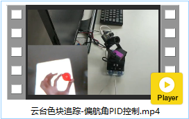
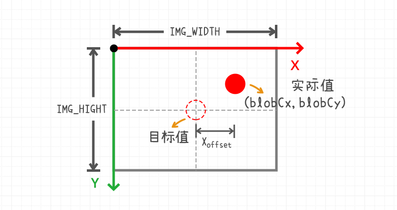
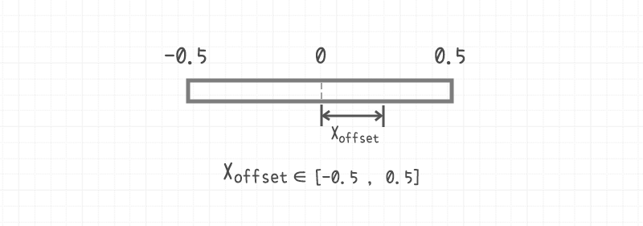
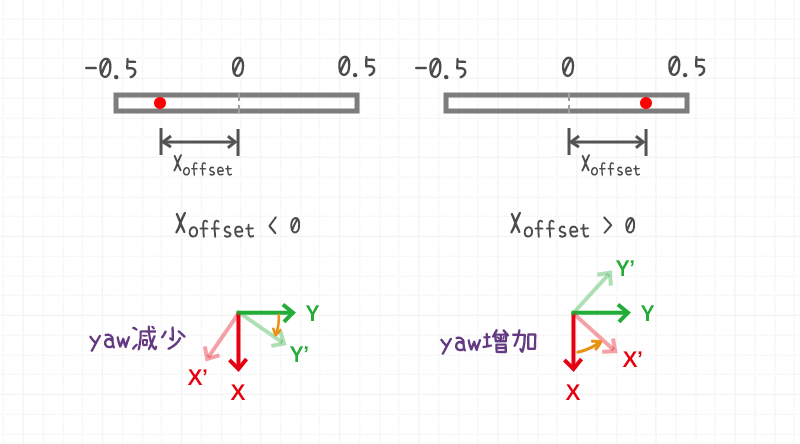
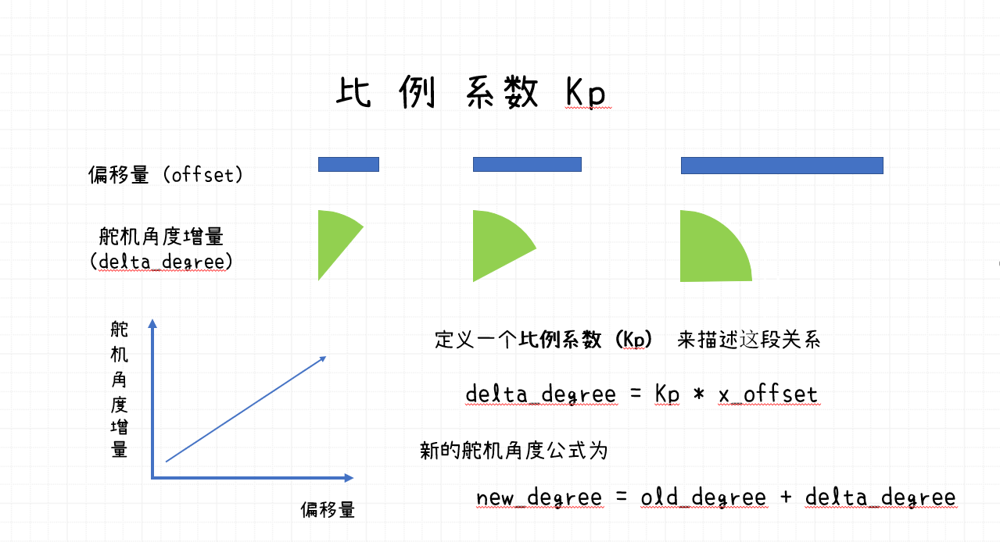
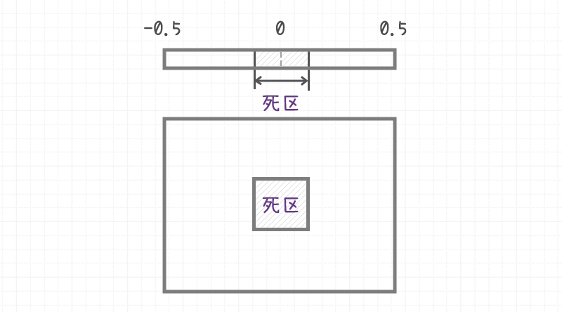

# 云台色块追踪-偏航角单级PID控制


[toc]

## 概要

云台色块追踪项目主要分为两个部分

1. **视觉部分**：OpenMV识别到目标色块，并将物块的坐标通过串口通信协议发送给STM32。
2. **控制部分**：STM32负责控制舵机云台，更新舵机云台当前的角度。根据物块的坐标信息控制云台，控制物块保持在OpenMV画面的中心位置。

为了方便理解，在实现的时候先只考虑云台的其中一个轴，假设舵机云台下方的舵机是可以旋转的，而上方的舵机保持静止。

 

## 效果视频

[云台色块追踪-偏航角PID控制](http://v.qq.com/x/page/r3045ueywup.html)




## PID控制

**PID控制**全称为比例-积分-微分控制器，是自控原理里面最经典、使用最广泛的算法。

| 缩写  | 名称 | 英文       |
| ----- | ---- | ---------- |
| **P** | 比例 | Proportion |
| **I** | 积分 | Integral   |
| **D** | 微分 | Derivative |


### 偏移量$x_{offset}$



OpenMV画面的宽度为`IMG_WIDTH`，高度为`IMG_HEIGHT`，单位为像素。

小球中心的坐标为`(blobCx, blobCy)`，在当前这个单轴的例子中，我们只需要用到小球的x坐标`blobCx`。


**目标值（target）** 是小球目标的位置，小球x坐标的目标值是图像中心处。

**实际值（real）** 是小球当前在画面中的位置，有时也被称为 **测量值（measurement）**。

**偏移量（offset）** 是实际值与目标值之间的误差，偏移量有时候也被称为 **误差（error）**，记做$x_{offset} $。


为了方便后续PID的计算不受图像分辨率的影响，一般需要对测量值/偏移量进行归一化操作。

归一化之后，偏移量的取值范围为$x_{offset} \in [-0.5, 0.5]$。



```c
// 计算当前的偏移量
curXOffset =((blobCx / IMG_WIDTH) - 0.5);
```

**首先，我们需要根据偏移量$x_{offset}$的正负判断舵机云台该向那个方向移动。**

$x_{offset} > 0$ 时，舵机应该向云台偏航角增加的方向旋转。

$x_{offset} < 0$ 时，舵机应该向云台偏航角减少的方向旋转。




### 比例系数$K_p$

在获得舵机下一个控制周期的旋转方向之后，还需要知道旋转的**幅度**。

偏移量$x_{offset}$ 绝对值越大，舵机旋转的幅度也就应该越大，线性关系是描述这种关系的其中一种表示方法。

这个线性关系的斜率即为PID控制器里面的比例系数$K_p$ 。
$$
dyaw =  K_p * x_{offset}
$$
$dyaw$ 是偏航角的增量。





当$K_p$ 过小时，舵机会出现动作迟缓，容易丢失目标的问题。

当$Kp$ 过大时，舵机就会出现**震荡**的问题，舵机频繁的来回摆动。


### 微分系数$K_d$

所谓微分指的就是$x_{offset}$ 的变化率，旧的$x_{offset}$ 减去新的$x_{offset}$ 。
$$
dx_{offset} = old\_x_{offset} - x_{offset}
$$

$$
dyaw =  K_p * x_{offset} + K_d*dx_{offset} 
$$


微分系数也叫阻尼系数，$Kd$ 的作用是给舵机角度变换添加一定的阻力，抑制舵机角度震荡。


### 死区 Deadblock



为了防止舵机在目标值附近的震荡，会设置死区。

```c
#define DEAD_BLOCK 0.05
```

当偏移量$x_{offset}$ 的绝对值小于死区时，将偏移量置为0。

```c
// 判断是否在死区内
if (__fabs(curXOffset) <= DEAD_BLOCK){
    curXOffset = 0;
}
```


### 舵机PID控制的核心算法C语言实现

```c
// 云台偏航角PID控制
void GimbalYawPIDCtl(){
	float dYaw; // 偏航角的增量
	
	// 更新上一次的偏移量
	lastXOffset = curXOffset;
	// 计算当前的偏移量
	curXOffset =((blobCx / IMG_WIDTH) - 0.5);
	// 判断是否在死区内
	if (__fabs(curXOffset) <= DEAD_BLOCK){
		curXOffset = 0;
	}
	
	// 计算得到偏航角的增量
	dYaw = GIMBAL_YAW_KP * curXOffset + GIMBAL_YAW_KD * (lastXOffset - curXOffset);
	// 云台偏航角控制
	Gimbal_SetYaw(servoUsart, curYaw + dYaw, servoSpeed);
	
	printf("YAW PID: dYaw = %.1f next yaw = %.1f\r\n", dYaw, curYaw + dYaw);
}
```


## 操作流程

### OpenMV与STM32接线

| STM32F103        | OpenMV3             |
| ---------------- | ------------------- |
| PB_11 (UART3 Rx) | P4 (PB10, UART3 Tx) |
| PB_10 (UART3 Tx) | P5 (PB11, UART3 Rx) |
| GND              | GND                 |
| 5V               | VIN                 |

> 注意: STM32F103的5V注意不能接到OpenMV的3.3v上，会烧坏管脚。

详情见文档 *接线说明*


### OpenMV 颜色阈值

调节OpenMV中的颜色阈值`RED_BALL_THRESHOLD`

```python
# 红色小球的LAB色彩空间阈值 (L Min, L Max, A Min, A Max, B Min, B Max)
RED_BALL_THRESHOLD = (57, 74, 38, 85, -21, 62)
```

### 云台PID参数调节

```c
// 云台偏航角PID控制
#define DEAD_BLOCK 0.05
#define GIMBAL_YAW_KP 90.0
#define GIMBAL_YAW_KD 1.0
```

初始调节时，将`GIMBAL_YAW_KD` 设置为0。将逐渐增加比例系数`GIMBAL_YAW_KP`，直到舵机云台发生明显的**抖动**，此时调节`GIMBAL_YAW_KD`（阻尼力）让舵机云台变稳定。


## 主程序完整源码

### OpenMV

调节OpenMV中的颜色阈值`RED_BALL_THRESHOLD`

```python
'''
色块识别
1. 识别画面中的红色小球
2. 将识别的到的色块位置,通过串口发送
'''
import sensor
import image
import time
import ustruct as struct
from pyb import UART

# 红色小球的LAB色彩空间阈值 (L Min, L Max, A Min, A Max, B Min, B Max)
RED_BALL_THRESHOLD = (57, 74, 38, 85, -21, 62)

# 串口初始化
uart = UART(3, 115200)

# OpenMV感光芯片初始化
sensor.reset() # 重置感芯片
sensor.set_pixformat(sensor.RGB565) # 设置像素格式为RGB565
sensor.set_framesize(sensor.QVGA) # 设置分辨率为QVGA (340 * 240)
sensor.set_vflip(True)
sensor.skip_frames(time = 2000) # 跳过2s内的帧, 等待画质稳定
sensor.set_auto_gain(False) # 关闭自动增益
sensor.set_auto_whitebal(False) # 关闭自动白平衡

# 初始化时钟
clock = time.clock()

while(True):
    clock.tick() # 开始计时
    img = sensor.snapshot() # 拍摄一张照片
    # 获取画面中的色块
    blobs = img.find_blobs([RED_BALL_THRESHOLD], pixels_threshold=100, area_threshold=100, merge=True)
    if len(blobs) != 0:
        # 获得画面中的最大的色块
        blob = max(blobs, key=lambda  b: b.area())
        # 可视化
        img.draw_rectangle(blob.rect()) # 绘制色块的矩形区域
        img.draw_cross(blob.cx(), blob.cy()) # 绘制色块的中心位置
        print("色块中心坐标: {} {}".format(blob.cx(), blob.cy()))
        # 通过串口发送数据(二进制　低字节序)
        uart.write(struct.pack('<BBBHH', 0xFF, 0xF1, True, blob.cx(), blob.cy()))
    else:
        # 目标丢失
        print("色块丢失!!!")
        # 通过串口发送数据(二进制　低字节序)
        uart.write(struct.pack('<BBBHH', 0xFF, 0xF1, False, 0, 0))
    # 打印当前的帧率
    print(clock.fps())
```


### STM32

```c
/***************************************************
 * 云台色块追踪-偏航角单级PID控制
 ***************************************************/
#include "stm32f10x.h"
#include "usart.h"
#include "sys_tick.h"
#include "fashion_star_uart_servo.h"
#include "gimbal.h"
#include "button.h"

#define TRUE 1
#define FALSE 0

#define IMG_WIDTH 320.0 // blob画面分辨率 宽度
#define IMG_HEIGHT 240.0 // blob画面分辨率 高度
#define BLOB_PKG_LEN 7 // blob数据包的长度
#define BLOB_PKG_HEADER 0xFF // 帧头
#define BLOB_PKG_CMD_ID 0xF1 // 指令ID

// 云台偏航角PID控制
#define DEAD_BLOCK 0.05
#define GIMBAL_YAW_KP 32.0
#define GIMBAL_YAW_KD 2.0

// 使用串口1作为舵机控制的端口
// <接线说明>
// STM32F103 PA9(Tx)  <----> 串口舵机转接板 Rx
// STM32F103 PA10(Rx) <----> 串口舵机转接板 Tx
// STM32F103 GND 	  <----> 串口舵机转接板 GND
// STM32F103 V5 	  <----> 串口舵机转接板 5V
// <注意事项>
// 使用前确保已设置usart.h里面的USART1_ENABLE为1
// 设置完成之后, 将下行取消注释
Usart_DataTypeDef* servoUsart = &usart1; 
// 使用串口2作为日志输出的端口
// <接线说明>
// STM32F103 PA2(Tx) <----> USB转TTL Rx
// STM32F103 PA3(Rx) <----> USB转TTL Tx
// STM32F103 GND 	 <----> USB转TTL GND
// STM32F103 V5 	 <----> USB转TTL 5V (可选)
// <注意事项>
// 使用前确保已设置usart.h里面的USART2_ENABLE为1
Usart_DataTypeDef* loggingUsart = &usart2;
// 重定向c库函数printf到串口，重定向后可使用printf函数
int fputc(int ch, FILE *f)
{
	while((loggingUsart->pUSARTx->SR&0X40)==0){}
	/* 发送一个字节数据到串口 */
	USART_SendData(loggingUsart->pUSARTx, (uint8_t) ch);
	/* 等待发送完毕 */
	// while (USART_GetFlagStatus(USART1, USART_FLAG_TC) != SET);		
	return (ch);
}


// 使用串口3接收来自OpenMV的消息
// <接线说明>
// STM32F103 PB10(Tx) <----> OpenMV P5 (UART3 Rx)
// STM32F103 PB11(Rx) <----> OpenMV P4 (UART3 Tx)
// STM32F103 GND 	  <----> OpenMV GND
// STM32F103 V5 	  <----> OpenMV Vin (5v)
// <注意事项>
// 使用前确保已设置usart.h里面的USART3_ENABLE为1
Usart_DataTypeDef* blobUsart = &usart3;


uint8_t blobPkgBuf[BLOB_PKG_LEN]; // blob数据帧缓冲区
uint8_t blobPkgIdx = 0;

float servoSpeed = 400.0; // 云台旋转速度 (单位: °/s)
uint8_t hasBlob = FALSE; // 画面中有无色块
uint16_t blobCx = 0; // 色块中心的x坐标
uint16_t blobCy = 0; // 色块中心的y坐标

float curXOffset = 0; // 当前x轴方向上的偏移量
float lastXOffset = 0; // 上一次x轴方向上的偏移量

// 更新色块的信息
void updateBlobInfo(Usart_DataTypeDef* blobUsart){
	uint8_t tempByte;
	while(RingBuffer_GetByteUsed(blobUsart->recvBuf)){
		// 弹出队首元素
		tempByte = RingBuffer_Pop(blobUsart->recvBuf);
		
		if (blobPkgIdx == 0 && tempByte != BLOB_PKG_HEADER){
			// 帧头还未接收且帧头不匹配
			continue;
		}else if(blobPkgIdx == 1 && tempByte != BLOB_PKG_CMD_ID){
			// 数据指令不匹配
			blobPkgIdx = 0;
			continue;
		}
		
		// 缓冲区内追加数据
		blobPkgBuf[blobPkgIdx] = tempByte;
		blobPkgIdx += 1;
		
		if (blobPkgIdx >= BLOB_PKG_LEN){
			// 数据接收完成, 解析更新数据
			hasBlob = blobPkgBuf[2];
			// 高通滤波, 抵抗图像处理噪声
			blobCx = 0.3*blobCx + 0.7*(uint16_t)(blobPkgBuf[3] | blobPkgBuf[4] << 8);
			blobCy = 0.3*blobCy + 0.7*(uint16_t)(blobPkgBuf[5] | blobPkgBuf[6] << 8);
			
			blobPkgIdx = 0; // 游标清零
		}
	}
}

// 云台偏航角PID控制
void GimbalYawPIDCtl(){
	float dYaw; // 偏航角的增量
	
	// 更新上一次的偏移量
	lastXOffset = curXOffset;
	// 计算当前的偏移量
	curXOffset =((blobCx / IMG_WIDTH) - 0.5);
	// 判断是否在死区内
	if (__fabs(curXOffset) <= DEAD_BLOCK){
		curXOffset = 0;
	}
	
	// 计算得到偏航角的增量
	dYaw = GIMBAL_YAW_KP * curXOffset + GIMBAL_YAW_KD * (lastXOffset - curXOffset);
	// 云台偏航角控制
	Gimbal_SetYaw(servoUsart, curYaw + dYaw, servoSpeed);
	
	printf("YAW PID: dYaw = %.1f next yaw = %.1f\r\n", dYaw, curYaw + dYaw);
}


int main (void)
{
	SysTick_Init(); 		// 嘀嗒定时器初始化
	Usart_Init(); 			// 串口初始化
	Gimbal_Init(servoUsart);// 云台初始化
	
	while(1){
		// 更新色块的位置信息
		if (RingBuffer_GetByteUsed(blobUsart->recvBuf) >= BLOB_PKG_LEN) {
			updateBlobInfo(blobUsart);
		}
		// 打印日志
		// printf("has blob: %d blob_cx: %d blob_cy: %d\r\n", hasBlob, blobCx, blobCy);;
		
		// 更云台位姿
		Gimbal_Update(servoUsart);
		
		if (hasBlob){
			GimbalYawPIDCtl();
		}else{
			// 拓展-添加色块丢失的处理策略
		}
		// 延时10ms
		SysTick_DelayMs(20);
		
	}
}
```

