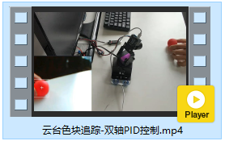

# 云台色块追踪-双轴PID控制


[toc]

## 效果视频

[云台色块追踪-双轴PID控制](http://v.qq.com/x/page/j30451v1amr.html)




## 双轴PID控制

色块的x轴的偏移量$x_{offset}$ 与 y轴的偏移量$y_{offset}$ 分别对应着云台偏航角与俯仰角的PID控制。两个轴的PID参数可以单独调试。


**PID参数**

```c
// 云台偏航角PID控制
#define DEAD_BLOCK 0.05
#define GIMBAL_YAW_KP 32.0
#define GIMBAL_YAW_KD 2.0
// 云台俯仰角PID控制
#define GIMBAL_PITCH_KP 32.0
#define GIMBAL_PITCH_KD 3.0
```

云台偏航角的PID控制器

```c
// 云台偏航角 PID控制
void GimbalYawPIDCtl(){
	float dYaw; // 偏航角的增量
	
	// 更新上一次的偏移量
	lastXOffset = curXOffset;
	// 计算当前的偏移量
	curXOffset =((blobCx / IMG_WIDTH) - 0.5);
	// 判断是否在死区内
	if (__fabs(curXOffset) <= DEAD_BLOCK){
		curXOffset = 0;
	}
	
	// 计算得到偏航角的增量
	dYaw = GIMBAL_YAW_KP * curXOffset + GIMBAL_YAW_KD * (lastXOffset - curXOffset);
	// 云台偏航角控制
	Gimbal_SetYaw(servoUsart, curYaw + dYaw, servoSpeed);
	
	printf("YAW PID: dYaw = %.1f next yaw = %.1f\r\n", dYaw, curYaw + dYaw);
}
```

云台俯仰角的PID控制器I

```c
// 云台俯仰角 PID控制
void GimbalPitchPIDCtl(){
	float dPitch; // 俯仰角的增量
	
	// 更新上一次的偏移量
	lastYOffset = curYOffset;
	// 计算当前的偏移量
	curYOffset =((blobCy / IMG_HEIGHT) - 0.5);
	// 判断是否在死区内
	if (__fabs(curYOffset) <= DEAD_BLOCK){
		curYOffset = 0;
	}
	
	// 计算得到偏航角的增量
	dPitch = GIMBAL_PITCH_KP * curYOffset + GIMBAL_PITCH_KD * (lastYOffset - curYOffset);
	// 云台偏航角控制
	Gimbal_SetPitch(servoUsart, curPitch + dPitch, 500);
	
	printf("YAW PID: dPitch = %.1f next pitch = %.1f\r\n", dPitch, curPitch + dPitch);
}
```


## 主程序完整源码

```c
/***************************************************
 * 云台色块追踪-双轴单级PID控制
 ***************************************************/
#include "stm32f10x.h"
#include "usart.h"
#include "sys_tick.h"
#include "fashion_star_uart_servo.h"
#include "gimbal.h"
#include "button.h"

#define TRUE 1
#define FALSE 0

#define IMG_WIDTH 320.0 // blob画面分辨率 宽度
#define IMG_HEIGHT 240.0 // blob画面分辨率 高度
#define BLOB_PKG_LEN 7 // blob数据包的长度
#define BLOB_PKG_HEADER 0xFF // 帧头
#define BLOB_PKG_CMD_ID 0xF1 // 指令ID

// 云台偏航角PID控制
#define DEAD_BLOCK 0.05
#define GIMBAL_YAW_KP 32.0
#define GIMBAL_YAW_KD 2.0
// 云台俯仰角PID控制
#define GIMBAL_PITCH_KP 32.0
#define GIMBAL_PITCH_KD 3.0

// 使用串口1作为舵机控制的端口
// <接线说明>
// STM32F103 PA9(Tx)  <----> 串口舵机转接板 Rx
// STM32F103 PA10(Rx) <----> 串口舵机转接板 Tx
// STM32F103 GND 	  <----> 串口舵机转接板 GND
// STM32F103 V5 	  <----> 串口舵机转接板 5V
// <注意事项>
// 使用前确保已设置usart.h里面的USART1_ENABLE为1
// 设置完成之后, 将下行取消注释
Usart_DataTypeDef* servoUsart = &usart1; 
// 使用串口2作为日志输出的端口
// <接线说明>
// STM32F103 PA2(Tx) <----> USB转TTL Rx
// STM32F103 PA3(Rx) <----> USB转TTL Tx
// STM32F103 GND 	 <----> USB转TTL GND
// STM32F103 V5 	 <----> USB转TTL 5V (可选)
// <注意事项>
// 使用前确保已设置usart.h里面的USART2_ENABLE为1
Usart_DataTypeDef* loggingUsart = &usart2;
// 重定向c库函数printf到串口，重定向后可使用printf函数
int fputc(int ch, FILE *f)
{
	while((loggingUsart->pUSARTx->SR&0X40)==0){}
	/* 发送一个字节数据到串口 */
	USART_SendData(loggingUsart->pUSARTx, (uint8_t) ch);
	/* 等待发送完毕 */
	// while (USART_GetFlagStatus(USART1, USART_FLAG_TC) != SET);		
	return (ch);
}

// 使用串口3接收来自blob的消息
// <接线说明>
// STM32F103 PB10(Tx) <----> blob P5 (UART3 Rx)
// STM32F103 PB11(Rx) <----> blob P4 (UART3 Tx)
// STM32F103 GND 	  <----> blob GND
// STM32F103 V5 	  <----> blob Vin (5v)
// <注意事项>
// 使用前确保已设置usart.h里面的USART3_ENABLE为1
Usart_DataTypeDef* blobUsart = &usart3;


uint8_t blobPkgBuf[BLOB_PKG_LEN]; // blob数据帧缓冲区
uint8_t blobPkgIdx = 0;

float servoSpeed = 400.0; // 云台旋转速度 (单位: °/s)
uint8_t hasBlob = FALSE; // 画面中有无色块
uint16_t blobCx = 0; // 色块中心的x坐标
uint16_t blobCy = 0; // 色块中心的y坐标

float curXOffset = 0; // 当前x轴方向上的偏移量
float lastXOffset = 0; // 上一次x轴方向上的偏移量

float curYOffset = 0; // 当前y轴方向上的偏移量
float lastYOffset = 0; // 上一次y轴方向上的偏移量

// 更新色块的信息
void updateBlobInfo(Usart_DataTypeDef* blobUsart){
	uint8_t tempByte;
	while(RingBuffer_GetByteUsed(blobUsart->recvBuf)){
		// 弹出队首元素
		tempByte = RingBuffer_Pop(blobUsart->recvBuf);
		
		if (blobPkgIdx == 0 && tempByte != BLOB_PKG_HEADER){
			// 帧头还未接收且帧头不匹配
			continue;
		}else if(blobPkgIdx == 1 && tempByte != BLOB_PKG_CMD_ID){
			// 数据指令不匹配
			blobPkgIdx = 0;
			continue;
		}
		
		// 缓冲区内追加数据
		blobPkgBuf[blobPkgIdx] = tempByte;
		blobPkgIdx += 1;
		
		if (blobPkgIdx >= BLOB_PKG_LEN){
			// 数据接收完成, 解析更新数据
			hasBlob = blobPkgBuf[2];
			// 高通滤波, 抵抗图像处理噪声
			blobCx = 0.3*blobCx + 0.7*(uint16_t)(blobPkgBuf[3] | blobPkgBuf[4] << 8);
			blobCy = 0.3*blobCy + 0.7*(uint16_t)(blobPkgBuf[5] | blobPkgBuf[6] << 8);
			
			blobPkgIdx = 0; // 游标清零
		}
	}
}

// 云台偏航角 PID控制
void GimbalYawPIDCtl(){
	float dYaw; // 偏航角的增量
	
	// 更新上一次的偏移量
	lastXOffset = curXOffset;
	// 计算当前的偏移量
	curXOffset =((blobCx / IMG_WIDTH) - 0.5);
	// 判断是否在死区内
	if (__fabs(curXOffset) <= DEAD_BLOCK){
		curXOffset = 0;
	}
	
	// 计算得到偏航角的增量
	dYaw = GIMBAL_YAW_KP * curXOffset + GIMBAL_YAW_KD * (lastXOffset - curXOffset);
	// 云台偏航角控制
	Gimbal_SetYaw(servoUsart, curYaw + dYaw, servoSpeed);
	
	printf("YAW PID: dYaw = %.1f next yaw = %.1f\r\n", dYaw, curYaw + dYaw);
}


// 云台俯仰角 PID控制
void GimbalPitchPIDCtl(){
	float dPitch; // 俯仰角的增量
	
	// 更新上一次的偏移量
	lastYOffset = curYOffset;
	// 计算当前的偏移量
	curYOffset =((blobCy / IMG_HEIGHT) - 0.5);
	// 判断是否在死区内
	if (__fabs(curYOffset) <= DEAD_BLOCK){
		curYOffset = 0;
	}
	
	// 计算得到偏航角的增量
	dPitch = GIMBAL_PITCH_KP * curYOffset + GIMBAL_PITCH_KD * (lastYOffset - curYOffset);
	// 云台偏航角控制
	Gimbal_SetPitch(servoUsart, curPitch + dPitch, 500);
	
	printf("YAW PID: dPitch = %.1f next pitch = %.1f\r\n", dPitch, curPitch + dPitch);
}

int main (void)
{
	SysTick_Init(); 		// 嘀嗒定时器初始化
	Usart_Init(); 			// 串口初始化
	Gimbal_Init(servoUsart);// 云台初始化
	
	while(1){
		// 更新色块的位置信息
		if (RingBuffer_GetByteUsed(blobUsart->recvBuf) >= BLOB_PKG_LEN) {
			updateBlobInfo(blobUsart);
		}
		// 更云台位姿
		Gimbal_Update(servoUsart);
		
		if (hasBlob){
			GimbalYawPIDCtl();
			GimbalPitchPIDCtl();
		}else{
			// TODO 拓展部分-添加色块丢失的处理策略
		}
		// 延时10ms
		// SysTick_DelayMs(10);
		
	}
}
```

