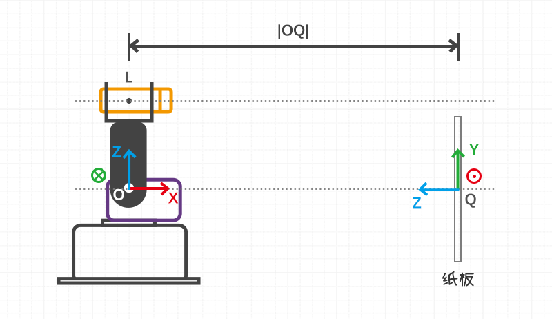
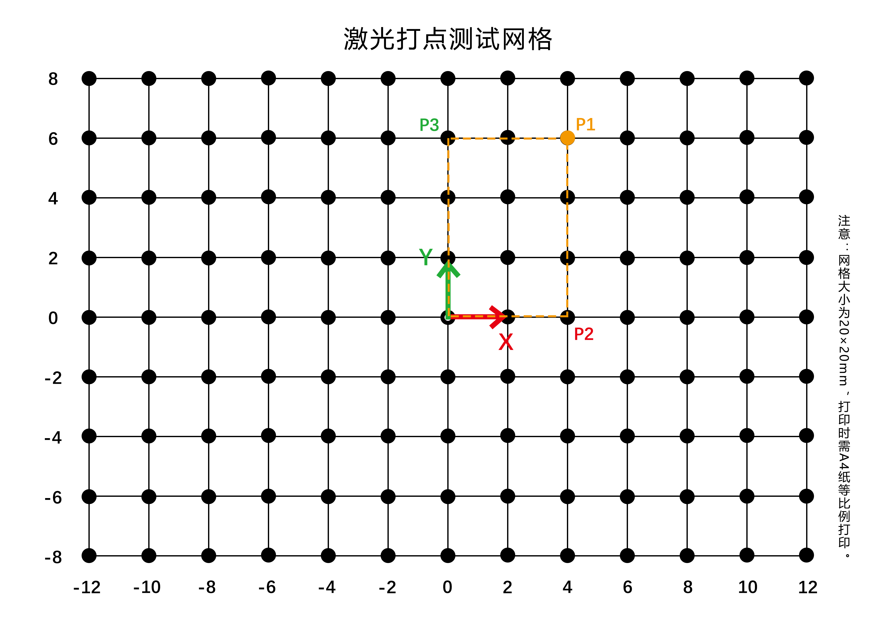
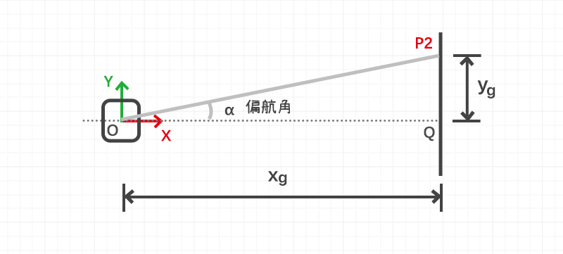
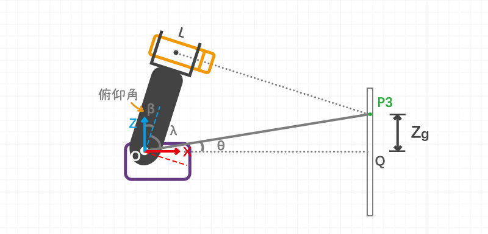
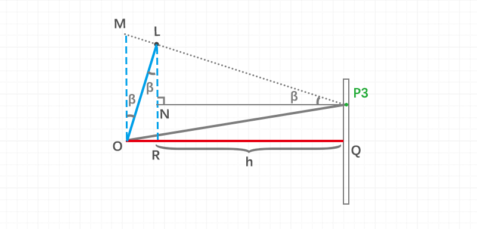
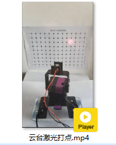
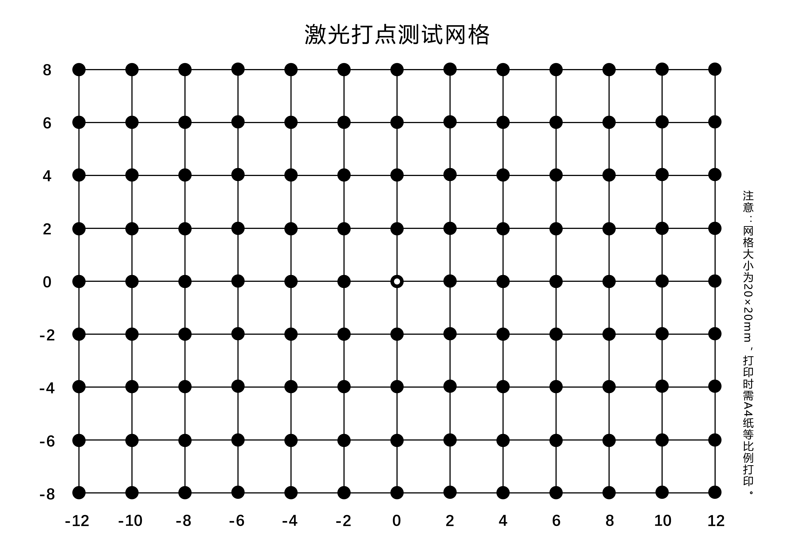

# 云台激光打点


[toc]


## 激光打点原理

### 坐标系与点的定义

设全局坐标系为$G$  



$G$坐标系原点记作$O$，为云台1号舵机旋转轴的中心。

激光笔垂直于U型支架，U型支架所在的直线与激光轴线的交点为$L$。


纸板坐标系$B$ 



纸板放置于云台的正前方，纸板坐标系的原点记作$Q$，位于云台坐标系的X轴上。

纸板坐标系的x轴平行于云台坐标系的y轴，纸板坐标系的y轴平行于云台坐标系的z轴。


激光点记作$P_1$  ，激光点在纸板坐标系下的坐标为$^BP_1$
$$
^BP_1 = [x_b, y_b, 0]^T
$$
$P_1$ 在纸板坐标系的x轴的投影点为$P_2$
$$
^BP_2 = [x_b, 0, 0]^T
$$
$P_1$ 在纸板坐标系的y轴的投影点为$P_3$ 
$$
^BP_3 = [0, y_b, 0]^T
$$


### 坐标系转换

全局坐标系$G$ 与纸板坐标系$B$ 之间的转换关系如下：


点P在纸板坐标系中的坐标
$$
^BP = [x_b, y_b, 0]^T
$$

点P在全局坐标系中的坐标
$$
^GP = [x_g, y_g, z_g]^T
$$

其中
$$
x_g = |OQ|
$$

$$
y_g = -x_b
$$

$$
z_g = y_b
$$


*`main.c`代码片段*

```c
/* 纸板(Board: [xb, yb])坐标系转化为全局坐标系(Global: [xg, yg, zg])*/
void TF_Board2Global(float xb, float yb, float *xg, float *yg, float *zg){
	*xg = OQ;
	*yg = -xb;
	*zg = yb;
}

/* 全局坐标系转换为纸板坐标系*/
void TF_Global2Board(float xg, float yg, float zg, float *xb, float *yb){
	*xb = -yg;
	*yb = zg;
}
```


### 正向运动学

正向运动学（**Forward Kinematics**），就是给定舵机云台的偏航角$\alpha$ 与俯仰角 $\beta$ ，求解激光点在纸板上的位置。

激光点在纸板上的坐标$^BP_1 = [x_b, y_b, 0]^T$ 需要先转换为激光点在全局坐标系下的坐标$^GP_1 = [x_g, y_g, z_g]$  。


$x_b$ 与云台的偏航角有关，$y_b$ 与云台的俯仰角有关。所以在处理正/逆向运动学问题的时候，可以将其拆解为两个独立的过程。


$x_g$ 是已知的
$$
x_g = |OQ|
$$

**1. 根据偏航角$\alpha$求解$y_g$**



$$
tan(\alpha) = \frac{y_g}{x_g}
$$

$$
y_g  = x_g * tan(\alpha)
$$


**2. 根据俯仰角$\beta$求解$z_g$**





$$
|LR| = |OL| * cos(\beta)
$$

$$
|OR| = |OL| * sin(\beta)
$$

$$
\begin{align*}
|NP_3| &= |RQ|\\
&= |OQ| - |OR| \\
&= |OQ| - |OL|*sin(\beta)\\
\end{align*}
$$

$$
\begin{align*}
z_g &= |P_3Q| \\
&= |NR|\\
&= |LR| - |LN| \\
&= |OL| * cos(\beta) - |NP_3|*tan(\beta) \\
&= |OL| * cos(\beta) - [|OQ| - |OL|*sin(\beta)]*tan(\beta)\\
&= |OL| * cos(\beta) - [x_g - |OL|*sin(\beta)]*tan(\beta)
\end{align*}
$$


其中$|OL|$ 是常量。


*`main.c`代码片段*

```c
/* 云台正向运动学*/
void FK_GimbalLaser(float alpha, float beta, float *xb, float *yb){
	float xg, yg, zg;
	xg = OQ;
	yg = xg * tan(alpha);
	zg = OL*cos(beta) - (xg - OL *sin(beta))*tan(beta);
	TF_Global2Board(xg, yg, zg, xb, yb);
}
```


### 逆向运动学

逆向运动学刚好相反，需要制定激光点的坐标$^BP_1= [x_b, y_b, 0]^T$ ，求解此时云台的偏航角$\alpha$与俯仰角$\beta$。

在求解之前，同样需要先进行坐标系变换，计算激光点在全局坐标系下的坐标$^GP_1 = [x_g, y_g, z_g]$  。


**1. 根据$y_g$ 求解偏航角$\alpha$**


$$
\alpha = atan2(y_g, x_g)
$$


**2. 根据$z_g$ 求解俯仰角$\beta$**


$$
\theta = atan2(z_g, x_g)
$$


由勾股定理可知
$$
\begin{align*}
|OP_3|^2 &= |OQ|^2 + |P_3Q|^2 \\
&= x_g^2 + z_g^2
\end{align*}
$$

$$
|OP_3| = \sqrt{ x_g^2 + z_g^2}
$$


$$
\begin{align*}
\lambda &= acos(\frac{|OL|}{|OP_3|}) \\
&= acos(\frac{|OL|}{\sqrt{ x_g^2 + z_g^2}})
\end{align*}
$$

$$
\beta + \theta + \lambda = \frac{\pi}{2}
$$

$$
\beta = \frac{\pi}{2} - (\theta + \lambda)
$$

`main.c`代码片段

```c
/* 云台逆向运动学 */
void IK_GimbalLaser(float xg, float yg, float zg, float *alpha, float *beta){
	// 计算偏航角 Yaw(单位角度) = alpha
	*alpha = (atan2(yg, xg)) * RAD2DEG;
	// 计算俯仰角 Pitch(单位角度) = beta
	float theta = atan2(zg, xg);
	float OP3 = sqrt(pow(xg, 2) + pow(zg, 2));
	float lambda = acos(OL / OP3);
	*beta = (PI/2 - (theta + lambda))*RAD2DEG;
}
```


## 激光打点项目实战

### 效果视频

[云台激光打点](http://v.qq.com/x/page/g3045t4yhff.html)




### 操作流程

**1. 打印激光打点测试网格**

将*附件/激光打点测试网格.png* 打印在A4纸上，打印时选择无边框打印。




**2. 修改相关的宏定义**

理想情况下，每个网格的宽度都是2cm，但是打印出来可能会有少许偏差，需重新测量网格宽度，同步修改`GRID_WIDTH`

```c
#define GRID_WIDTH 1.916 // 网格的宽度 (单位cm) 以实际测量为准
```


测量云台坐标系原点距离激光轴心(Laser)的距离`OL`。

```c
#define OL 5.4 // 云台坐标系原点距离激光轴心(Laser)的距离
```

按照上文*坐标系与点的定义* 里面的示意图，摆放云台与网格。

打开源代码里面的工程文件，编辑`main.c`里面的宏定义，根据网格跟云台的实际摆放的距离，修改`OQ`。

```c
#define OQ 25.0 // 云台(Gimbal)坐标系原点距离纸板(Board)坐标系原点的直线距离
```


**3. 激光笔供电**

 项目中使用的激光笔的功率是5mW，波长为650nm，IO口可以直接驱动。最简单的方法是正极接STM32的5v，负极接GND。


**4. 矫正网格位置**

初次张贴激光打点测试网格时，可能存在误差。

注释掉主程序while循环里面所有的代码，将代码烧录到STM32上。


激光笔会指向纸板坐标系的原点的位置。

如果激光落点与实际网格的中心之间存在偏移，此时需要移动网格或者云台，让二者重合。

```c
while (1){
    // 测试角点
    // TestCorner();
    // 测试水平方向打点
    // TestHorizontal();
    // 测试垂直方向打点
    // TestVertical();
    // 测试遍历所有的网格
    // TestVisitAllGrid();
}
```


**4. 激光打点功能测试**

接下来可以选择测试特定方向上的点，想测试哪个功能就将函数的注释去掉，例如测试遍历所有网格。

```c
while (1){
    // 测试角点
    // TestCorner();
    // 测试水平方向打点
    // TestHorizontal();
    // 测试垂直方向打点
    // TestVertical();
    // 测试遍历所有的网格
    TestVisitAllGrid();
}
```


### 主程序完整源码

```c
/***************************************************
* 舵机云台激光打点
 ***************************************************/
#include "stm32f10x.h"
#include "math.h"
#include "usart.h"
#include "sys_tick.h"
#include "fashion_star_uart_servo.h"
#include "gimbal.h"

#define PI 3.1415926
#define RAD2DEG 180 / PI // 弧度转换为角度的比例系数
#define GIMBAL_SERVO_SPEED 200.0 // 云台旋转速度 (单位: °/s)

// 机械结构参数
#define OQ 25.0 // 云台(Gimbal)坐标系原点距离纸板(Board)坐标系原点的直线距离
#define OL 5.4 // 云台坐标系原点距离激光轴心(Laser)的距离

// 纸板网格参数
#define GRID_WIDTH 1.916 // 网格的宽度 (单位cm) 以实际测量为准
#define GRID_COLUMN  12 // 网格的列数
#define GRID_ROW 	 8 	// 网格的行数

// 偏移量
#define XB_OFFSET 0
#define YB_OFFSET 0

// 使用串口1作为舵机控制的端口
// <接线说明>
// STM32F103 PA9(Tx)  <----> 串口舵机转接板 Rx
// STM32F103 PA10(Rx) <----> 串口舵机转接板 Tx
// STM32F103 GND 	  <----> 串口舵机转接板 GND
// STM32F103 V5 	  <----> 串口舵机转接板 5V
// <注意事项>
// 使用前确保已设置usart.h里面的USART1_ENABLE为1
// 设置完成之后, 将下行取消注释
Usart_DataTypeDef* servoUsart = &usart1; 

/* 纸板(Board: [xb, yb])坐标系转化为全局坐标系(Global: [xg, yg, zg])*/
void TF_Board2Global(float xb, float yb, float *xg, float *yg, float *zg){
	*xg = OQ;
	*yg = -xb;
	*zg = yb;
}

/* 全局坐标系转换为纸板坐标系*/
void TF_Global2Board(float xg, float yg, float zg, float *xb, float *yb){
	*xb = -yg;
	*yb = zg;
}

/* 云台正向运动学*/
void FK_GimbalLaser(float alpha, float beta, float *xb, float *yb){
	float xg, yg, zg;
	xg = OQ;
	yg = xg * tan(alpha);
	zg = OL*cos(beta) - (xg - OL *sin(beta))*tan(beta);
	TF_Global2Board(xg, yg, zg, xb, yb);
}

/* 云台逆向运动学 */
void IK_GimbalLaser(float xg, float yg, float zg, float *alpha, float *beta){
	// 计算偏航角 Yaw(单位角度) = alpha
	*alpha = (atan2(yg, xg)) * RAD2DEG;
	// 计算俯仰角 Pitch(单位角度) = beta
	float theta = atan2(zg, xg);
	float OP3 = sqrt(pow(xg, 2) + pow(zg, 2));
	float lambda = acos(OL / OP3);
	*beta = (PI/2 - (theta + lambda))*RAD2DEG;
}

/* 移动云台让激光打在纸板的特定位置上 */
void MoveTo(float xb, float yb){
	float xg, yg, zg; // 纸板上的目标点在云台坐标系下的位置
	float alpha;	// 云台偏航角
	float beta; 	// 云台俯仰角
	
	// 添加偏移量
	xb += XB_OFFSET;
	yb += YB_OFFSET;
	
	// 纸板坐标系转换为云台坐标系
	TF_Board2Global(xb, yb, &xg, &yg, &zg);
	// 云台逆向运动学
	IK_GimbalLaser(xg, yg, zg, &alpha, &beta);
	
	// 设置云台选择到目标位姿
	Gimbal_SetYaw(servoUsart, alpha, GIMBAL_SERVO_SPEED);
	Gimbal_SetPitch(servoUsart, beta, GIMBAL_SERVO_SPEED);
	
	// 等待云台旋转到目标位置
	Gimbal_Wait(servoUsart);
}

/* 移动到特定的网格位置上 */
void MoveToGrid(int8_t xi, int8_t yi){
	MoveTo(xi*GRID_WIDTH, yi*GRID_WIDTH);
}

/* 测试垂直方向打点 */
void TestVertical(){
	for(int8_t yi=4; yi>=-4; yi--){
		// 运动到原点
		MoveToGrid(0, yi);
		SysTick_DelayMs(1000);
	}
}

/* 测试横向方向打点 */
void TestHorizontal(){
	for(int8_t xi=-6; xi<=6; xi++){
		// 运动到原点
		MoveToGrid(xi, 0);
		SysTick_DelayMs(1000);
	}
}

/* 测试角点 */
void TestCorner(){
	// 运动到A点
	MoveToGrid(-6, 4);
	SysTick_DelayMs(1000);
		
	// 运动到B点
	MoveToGrid(6, 4);
	SysTick_DelayMs(1000);
		
	// 运动到C点
	MoveToGrid(6, -4);
	SysTick_DelayMs(1000);
		
	// 运动到D点
	MoveToGrid(-6, -4);
	SysTick_DelayMs(1000);
}

/* 测试遍历所有的网格 */
void TestVisitAllGrid(){
	for(int8_t yi=2; yi>=-2; yi--){
		for(int8_t xi=-3; xi<=3; xi++){
			// 运动到原点
			MoveToGrid(xi, yi);
			SysTick_DelayMs(1000);
		}
	}
}
int main (void)
{
	// 嘀嗒定时器初始化
	SysTick_Init();
	Usart_Init(); // 串口初始化
	// 云台初始化
	Gimbal_Init(servoUsart);
	// 运动到原点
	MoveToGrid(0, 0);
	SysTick_DelayMs(1000);
		
	// 等待2s
	SysTick_DelayMs(2000);	
	
	while (1){
		// 测试角点
		// TestCorner();
		
		// 测试水平方向打点
		// TestHorizontal();
		
		// 测试垂直方向打点
		// TestVertical();
		
		// 测试遍历所有的网格
		TestVisitAllGrid();
		
	}
}
```


## 激光打点误差分析

1. 舵机云台
   1. 舵机稳态误差（舵机死区）
   2. 舵机标定参数-比例系数误差
   3. 舵机标定参数-偏移量误差
2. 云台与标定板之间的位置误差
   1. 平移误差
   2. 旋转误差
3. 其他
   1. 桌面不平整
   2. 纸板张贴不正
   3. 纸板网格的印刷误差
   4. 机械加工误差
   5. 云台装配误差